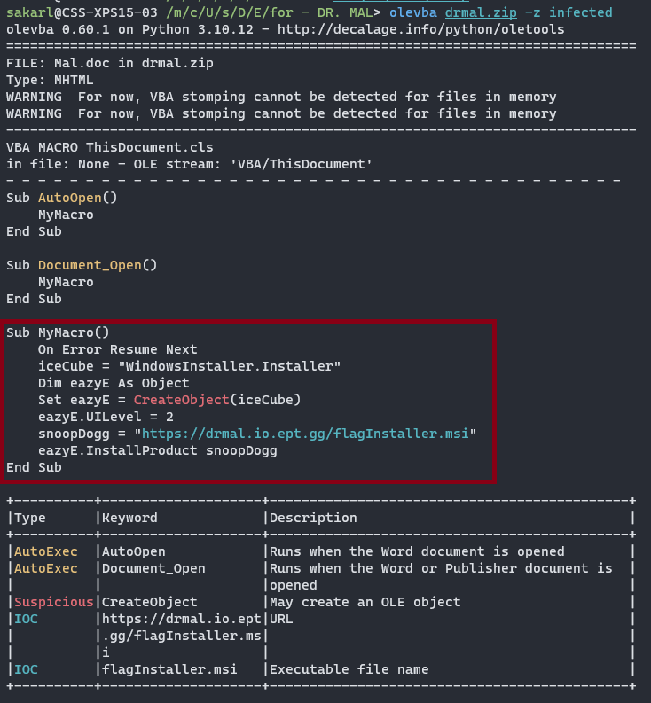

# DR. Mal
Author: LOLASL

Flag: `EPT{mAlD0c_c0mIn_sTr4igHt_0utt4_jAEr3n}`
## Description
```
Nowadays, everybody wanna talk like they got somethin' to say  
But nothing comes out when you enable things,  
Just a bunch of gibberish? Plz figure out what it brings.  

Forget about DRE, Mal D.O.C in da house!

*Password: infected*
```

## Provided challenge files
* [drmal.zip](drmal.zip)

## Writeup
The description hints for a malicious macro, which can be found in the MS document within the distributed ZIP-archive. Olevba is a tool from the Oletools suite to detect VBA Macros and extract their source code in clear text. The output from this tool on the challenge file is shown here.



The output shows how the macro, triggered on document open, defines a subroutine called "MyMacro." This subroutine creates a Windows Installer object, sets its UI level, and attempts to install a file from ```https://drmal.io.ept.gg/flagInstaller.msi```.

Trying to fetch this files provides a response complaining ```Invalid User-Agent```. Google-ing the default UA used by Windows Installer eventually resulted in post where the UA ```Windows Installer``` was discussed. This worked! And the site now instead responded with the flag.

```sh
> curl "https://drmal.io.ept.gg/flagInstaller.msi" -H "User-Agent: Windows Installer"
EPT{mAlD0c_c0mIn_sTr4igHt_0utt4_jAEr3n}⏎
```
