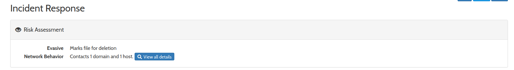
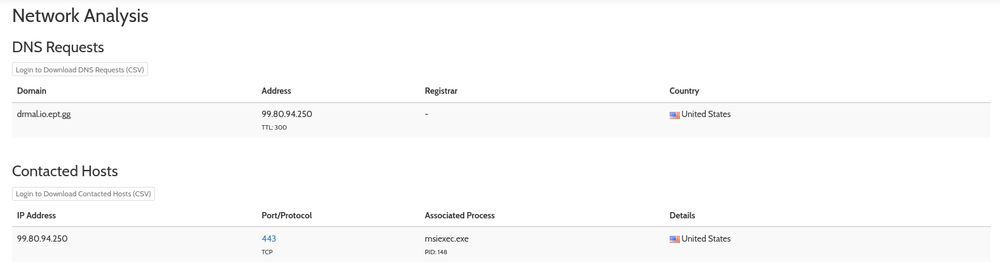
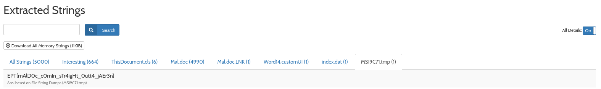

# Writeup
By Nikolas Papaioannou

We start by assuming that we need to find some macro of similar in the document, so we start by chucking it into a sandbox to run the code in a windows environment which acutally has word.

https://www.hybrid-analysis.com/sample/2a91f8f61dbaf0517e903cba34490ff87eec6063f6e8e1a9dd243baec2b4e650/654f47f5099f096ee507ad65

We see that the file is contacting an domain

More specifically via msiexec.exe

This would imply something is being downloaded, and it just so happens that the sandbox also extracted the flag string from what the macro just tried to download.

**Flag:** `EPT{mAlD0c_c0mIn_sTr4igHt_0utt4_jAEr3n}`

