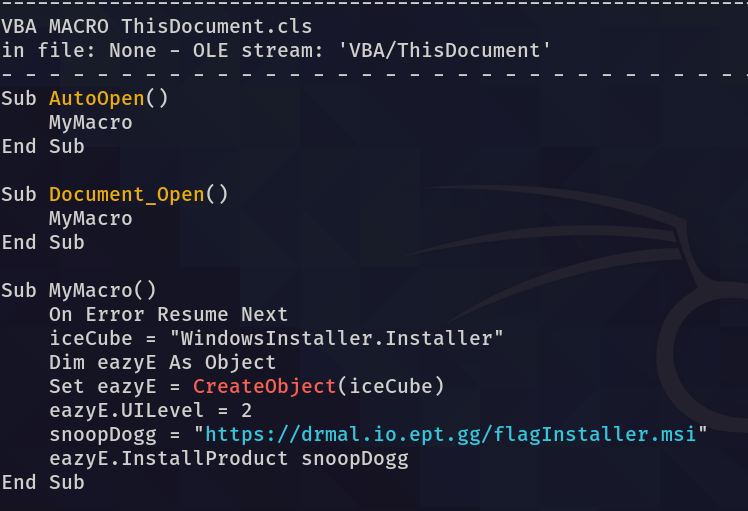
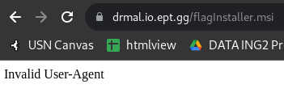
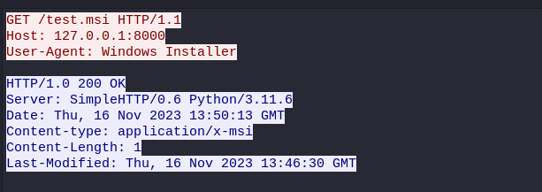

# DR. MAL

**Author: LOLASL**

**Challenge Description:**  
Nowadays, everybody wanna talk like they got somethin' to say  
But nothing comes out when you enable things,  
Just a bunch of gibberish? Plz figure out what it brings.

Forget about DRE, Mal D.O.C in da house!

**Password:** infected

---

## Solve
**By Oslolosen**

This was a really cool challenge. Finally, a VBA challenge where you don't have to spend 100 hours trying to deobfuscate the VBA code.

We received a zip file that contained a .doc file. The initial reaction was that this was an Office file with some malicious VBA code. So, the first step was to use oletools, more precisely, olevba.

Here we saw some VBA code that creates a request to download a file from the URL defined in the snoopDogg variable. Then we thought we just needed to obtain that .msi file, and we probably had the flag, but on the website, we were faced with an invalid user agent.

After some digging around to find the office user agent we could not find the right one, but we got an idea. Let's just separate the VBA code into its own VBA file, then set up a simple Python HTTP web server and track the traffic with WireShark. That way we could find the packet and copy the user agent.  

In the packet, it states Windows Installer as the user agent. Then, we simply changed the user agent with Burp and got the flag.

##### Flag: `EPT{mAlD0c_c0mIn_sTr4igHt_0utt4_jAEr3n}`
