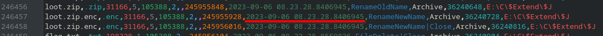
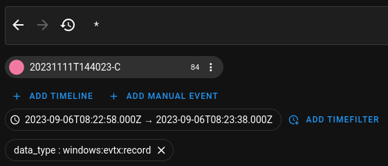
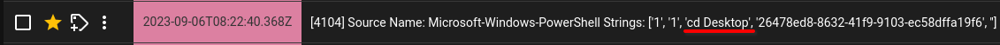
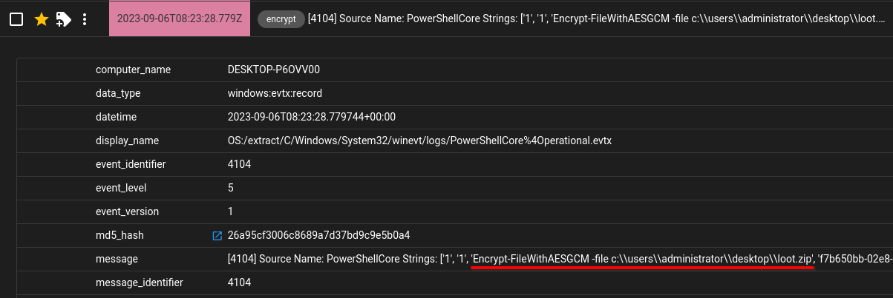
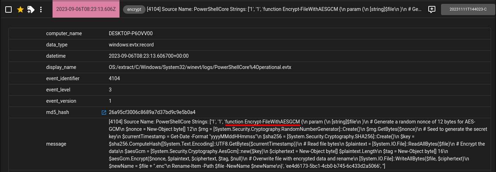
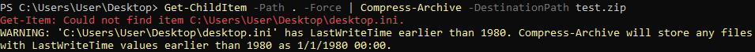
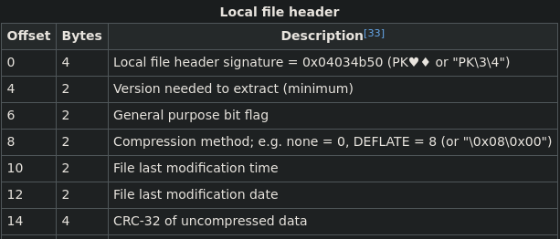
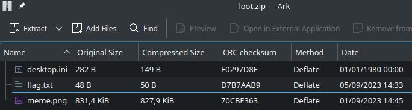

# 🔥 Misery 🔥

Author: LOLASL/zledge

Flag: `EPT{gCm_with0ut_t4g_1s_ju5t_CtR_c0unt1ng_from_2}`

## Description

```
Disaster! Our most important files have been stolen and are locked with what appears to be military grade encryption. We paid the ransom, but it turns out the criminal punks got the wrong type of crypto-bro for their scheme so they are unable to restore anything. Our IR-team managed to collect some artifacts with KAPE, but have no idea what to do next. Gather your most elite squad of forensicators and cryptographers to get our data back.
```

## Provided challenge files

- [misery.zip](../misery.zip)

## Solution (the indended way)

Author: [twelho](https://github.com/twelho/)

### Forensics

The provided [misery.zip](../misery.zip) archive contains two files:

- `2023-09-06T082701_asl.vhdx`, which is a [KAPE](https://www.kroll.com/en/insights/publications/cyber/kroll-artifact-parser-extractor-kape) artifact dump of the target system, and
- `loot.zip.enc`, which is a ZIP archive that has been externally encrypted in a yet-unknown way.

I started by looking at the artifact dump in order to figure out the encryption of the provided archive. This was done both manually and with some automation tools. Digging though the artifacts with [Zimmerman's tools](https://ericzimmerman.github.io/#!index.md), particularly when inspecting `$MFT` (the NTFS master file table) and `$Extended\$J` (the disk journal file) with `MFTECmd`, revealed some interesting files:

- `\Users\Administrator\Desktop\dammit.txt`
- `\Users\Administrator\Desktop\flag.txt`
- `\Users\Administrator\Desktop\meme.png`
- `\Users\Administrator\Desktop\loot.zip`
- `\Users\Administrator\Desktop\loot.zip.enc`

`dammit.txt` is readable directly by searching through `$MFT`. For thoroughness, it contains the following, but is not actually useful for the solution:

```text
https://www.youtube.com/watch?v=I4nnBj0w54U

plz vipps 1000000 dollarz to get files back <3

***EnemaOfTheState***
```

The next step I took is to run the entire artifact dump through `log2timeline`'s [Plaso](https://github.com/log2timeline/plaso):

````shell
psteal.py -o json_line --hashers md5,sha1 --source C --parsers "win7_slow" -w plaso.jsonl
````

To visualize the aggregated timeline, I deployed a local instance of [Timesketch](https://timesketch.org/) and uploaded the `.plaso` file generated above (which worked better than the `.jsonl` in this instance).

In order to narrow down the scope, we can use some clever inference from the `MFTECmd` output with timestamps. We're particularly interested in the creation of the `loot.zip.enc` file, as it is likely that details about the encryption are nearby:



In Timesketch, we can then create the following filter to inspect only the minutes around the `loot.zip.enc` creation. We can also apply the `data_type:"windows:evtx:records"` filter as a good first guess since it logs PowerShell executions:



Here we indeed find a PowerShell Core invocation of

```powershell
Get-ChildItem -Path . -Force | Compress-Archive -DestinationPath loot.zip
```

from the desktop:




The created archive is then encrypted with a custom encryption function `Encrypt-FileWithAESGCM`:



that is defined right above the invocation:



Here is the source code of `Encrypt-FileWithAESGCM`:

```powershell
function Encrypt-FileWithAESGCM {
 param (
 [string]$file
 )
 # Generate a random nonce of 12 bytes for AES-GCM
 $nonce = New-Object byte[] 12
 $rng = [System.Security.Cryptography.RandomNumberGenerator]::Create()
 $rng.GetBytes($nonce)
 # Seed to generate the secret key
 $currentTimestamp = Get-Date -Format "yyyyMMddHHmmss"
 $sha256 = [System.Security.Cryptography.SHA256]::Create()
 $key = $sha256.ComputeHash([System.Text.Encoding]::UTF8.GetBytes($currentTimestamp))
 # Read file bytes
 $plaintext = [System.IO.File]::ReadAllBytes($file)
 # Encrypt the data
 $aesGcm = [System.Security.Cryptography.AesGcm]::new($key)
 $ciphertext = New-Object byte[] $plaintext.Length
 $tag = New-Object byte[] 16
 $aesGcm.Encrypt($nonce, $plaintext, $ciphertext, $tag, $null)
 # Overwrite file with encrypted data and rename
 [System.IO.File]::WriteAllBytes($file, $ciphertext)
 $newName = $file + ".enc"
 Rename-Item -Path $file -NewName $newName
}
```

### Crypto

`Encrypt-FileWithAESGCM` uses AES-GCM to encrypt the given file in place and then renames it to have a `.enc` suffix. As we see above, the key derived by SHA256-hashing the current timestamp, which we can get from the timestamp of the execution. Note, however, that there are timezone differences at play, and the Plaso timestamps are in UTC. `Get-Date` fetches the local time (UTC+2 in this case), so the correct timestamp string to hash is `20230906102328`.

Next, the nonce is fully random and discarded by the function. Same with the tag generated by the encryption process, it is thrown away, and we don't have a memory dump. However, here we can rely on a trick that reduces AES-GCM to AES-CTR provided we don't feed in associated data, which is exactly the case here as the final parameter `associatedData` of `$aesGcm.Encrypt` is `$null`.

Now, in order to first recover the nonce, we can use the fact that XORing the plaintext and ciphertext for a block gives us the AES-ECB equivalent encryption for that block. The nonce is embedded in the first 12 bytes of the first block of this keystream. While we know the key and ciphertext, we don't know the plaintext. Here is where an oddity with PowerShell comes into play.

The invocation of `Get-ChildItem -Path . -Force | Compress-Archive -DestinationPath loot.zip` gathers all items, including hidden files, from the desktop, but can't actually read them properly. In particular, the hidden `desktop.ini` file (that will most likely be read first) will have its timestamp set to a well-known value:



Additionally, we can assume that we know the contents of (and thus checksum of) `desktop.ini`, as it is rarely modified. This leads into a unique situation regarding the architecture of ZIP files. In a ZIP file, the entires (files/directories) with their own local headers are listed first, and the index is appended as the last element:


To recover the first block with AES-ECB, we need the first 16 bytes of the plaintext in order to form a full block. These 16 bytes are formed entirely by the header of the first file, in our case `desktop.ini`:



(Image credit: [Wikipedia](https://en.wikipedia.org/wiki/ZIP_(file_format)))

As the timestamp is fully known (reset by PowerShell) as well as the CRC-32 (or the first two bytes of it), we can simply `Get-ChildItem -Path . -Force | Compress-Archive -DestinationPath test.zip` our own desktop (or just the `desktop.ini` file) in order to recover the 16 first plaintext bytes.

Finally, we can put everything together to decrypt `loot.zip.enc`:

```python
# References:
# https://crypto.stackexchange.com/questions/57903/does-aes-gcm-without-security-tag-turn-into-regular-ctr-mode
# https://stackoverflow.com/questions/49228671/aes-gcm-decryption-bypassing-authentication-in-java
# https://security.stackexchange.com/questions/238573/how-to-decrypt-a-ciphertext-encrypted-in-aes-ctr-mode-if-you-are-given-ciphertex

from Crypto.Cipher import AES
from Crypto.Hash import SHA256

with open("loot.zip.enc", "rb") as f:
	ciphertext = f.read()

# Recover the key from the event timestamp
currentTimestamp = "20230906102328"  # Goddamn timezones... this is UTC+2
key = SHA256.new(currentTimestamp.encode("utf-8")).digest()
print(len(key), key)

print("\n--- begin recovery ---\n")

# The desktop.ini file with known timestamp and contents is archived first,
# thus we know it's local header (especially the first 16 bytes of it)
with open("test.zip", "rb") as f:
	reference = f.read(16)

keystream = bytes((reference[i] ^ ciphertext[i] for i in range(16)))

# The nonce is encrypted as the first 12 bytes of the keystream
cipher = AES.new(key, AES.MODE_ECB)
plaintext = cipher.decrypt(keystream)
nonce = plaintext[:12]

# Initial value of 2 comes from the GCM spec
cipher = AES.new(key, AES.MODE_CTR, nonce=nonce, initial_value=2)
plaintext = cipher.decrypt(ciphertext)

# Verify that we've decrypted correctly
zip_header = b'PK\x03\x04'
assert plaintext[:4] == zip_header

# Write the decrypted ZIP archive to a file
with open("loot.zip", "wb") as f:
	f.write(plaintext)
```

As expected, `loot.zip` contains the `desktop.ini` file with the reset timestamp, as well as the flag and a meme:



`flag.txt` finally reveals us the flag: `EPT{gCm_with0ut_t4g_1s_ju5t_CtR_c0unt1ng_from_2}`

### Thanks

Thanks to LOLASL/zledge for this incredibly difficult, but very engaging and multidisciplinary challenge. While I didn't quite get there during the 10 hours of working on this in the CTF, I'm still incredibly proud that I finally managed to find the intended solution, learning a lot about forensics, PowerShell and AES on the way.

My Misery is finally over, now I can sleep in peace.

### Bonus

`meme.png` contains a high quality PowerShell meme as a price for escaping the Misery:


