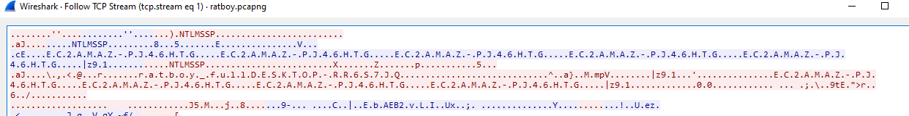
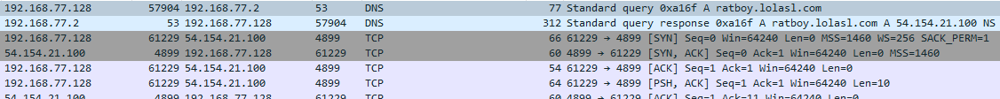
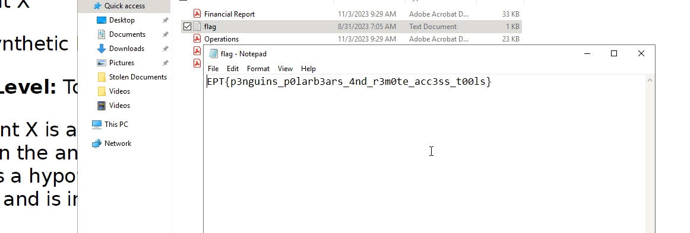

# Ratboy's Masterplan
Author: LOLASL

Flag: `EPT{p3nguins_p0larb3ars_4nd_r3m0te_acc3ss_t00ls}`
## Description
```
Intelligence suggests that someone in our organization is leaking sensitive information to an external entity. Our ultra-leet mega secure data loss prevention solution has not alerted on any such activity, but our tech team has managed to intercept a chunk of network traffic which we believe contain the rat's communication. Please find a way to get a peek at the leaked data. (<strike>Hackback</strike> Active Defense is not a crime?)
```

## Provided challenge files
* [ratboy.pcapng](ratboy.pcapng)

## Writeup
Upon analyzing the provided pcap file, we identified some NTLMSSP traffic, from which we can extract noteworthy information — specifically, the NetNTLMv2 hashes employed in both the challenge and challenge-response phases. The examination of the traffic has brought to light three distinct handshakes with their respective hashes that we can isolate. To facilitate the extraction process, several tools are at our disposal. One option involves manual extraction by incorporating the hash into the script [ntlmssp-decode.py](https://github.com/yaap7/miSCripts/blob/master/ntlmssp-decode.py), which we did. Alternatively, for a more streamlined approach, the hashes can be automatically extracted using the tool [NTLMRawUnHide](https://github.com/mlgualtieri/NTLMRawUnHide/tree/master). An example of the NTLMSSP challenge-response streans is shown below.



Here are the hashes extracted:

```txt
ratboy_full::.:c0e6cea745fbaccb:f9e6f68a5ec6df617d8ffd4d836d7056:01010000000000007c7a39fc31e6d901271e1baf88b594e20000000002001e0045004300320041004d0041005a002d0050004a003400360048005400470001001e0045004300320041004d0041005a002d0050004a003400360048005400470004001e0045004300320041004d0041005a002d0050004a003400360048005400470003001e0045004300320041004d0041005a002d0050004a0034003600480054004700070008007c7a39fc31e6d90106000400020000000800300030000000000000000100000000200000c020e03b145cea97397445fb223e72ebde36c8ce2f0ccdd387d3cd9af581e28c0a00100000000000000000000000000000000000090000000000000000000000

ratboy_view::.:8390f984cca995b8:ea128090784697741ea64f3d59fc9a18:0101000000000000060b801f32e6d9013db12b0da9e69eb40000000002001e0045004300320041004d0041005a002d0050004a003400360048005400470001001e0045004300320041004d0041005a002d0050004a003400360048005400470004001e0045004300320041004d0041005a002d0050004a003400360048005400470003001e0045004300320041004d0041005a002d0050004a003400360048005400470007000800060b801f32e6d90106000400020000000800300030000000000000000100000000200000c020e03b145cea97397445fb223e72ebde36c8ce2f0ccdd387d3cd9af581e28c0a00100000000000000000000000000000000000090000000000000000000000

admin:::9546ceb040d47edc:e81b5ac7f2e95fa6f1de548275844335:01010000000000001c26353032e6d9016bf36d25640cde9a0000000002001e0045004300320041004d0041005a002d0050004a003400360048005400470001001e0045004300320041004d0041005a002d0050004a003400360048005400470004001e0045004300320041004d0041005a002d0050004a003400360048005400470003001e0045004300320041004d0041005a002d0050004a0034003600480054004700070008001c26353032e6d90106000400020000000800300030000000000000000100000000200000c020e03b145cea97397445fb223e72ebde36c8ce2f0ccdd387d3cd9af581e28c0a00100000000000000000000000000000000000090000000000000000000000
```

Now we can try to crack these hashes with the rockyou passwordlist:
```bash
hashcat -a 0 -m 5600 ./ratboy.hash /usr/share/wordlists/rockyou.txt
```

This revealed the following user and password pairs: ```admin:admin``` and ```ratboy_view:millencolinnofx```.

Now looking at the traffic, there is a lot of traffic to the *port 4899* from the domain *ratboy.lolasl.com*. Port 4899 is the default port for the *radmin* tool. Given that the key is for the user *ratboy_view*. It could mean that ratboy accidentially leaked his own key for the service. The tool *radmin* can be downloaded [here](https://www.radmin.com/no/download/). This traffic is illustrated here.



Checking ratboy's source domain, we see that the port for radmin is up.

```
┌──(kali㉿kali)-[~/Documents]
└─$ nmap ratboy.lolasl.com -p 4899 -Pn
Starting Nmap 7.94 ( https://nmap.org ) at 2023-11-11 12:15 EST
Nmap scan report for ratboy.lolasl.com (52.210.134.226)
Host is up (0.055s latency).
Other addresses for ratboy.lolasl.com (not scanned): 34.240.140.3
rDNS record for 52.210.134.226: ec2-52-210-134-226.eu-west-1.compute.amazonaws.com

PORT     STATE SERVICE
4899/tcp open  radmin

Nmap done: 1 IP address (1 host up) scanned in 0.27 seconds
```

The tool *radmin* has a lot of settings. Connecting with the key by default will not work as the default setting is to give the user an interactive session with control over the server. The hint here lies within the username *ratboy_view*, indicating that we should have a view-only session. By changing this in the tool, we get access to ratboys server!

Monitoring his session, we see that the user opens the flag:


