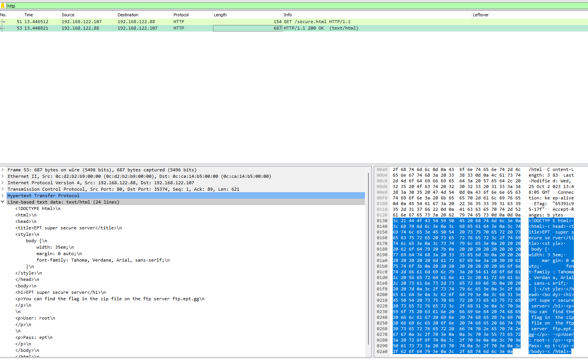
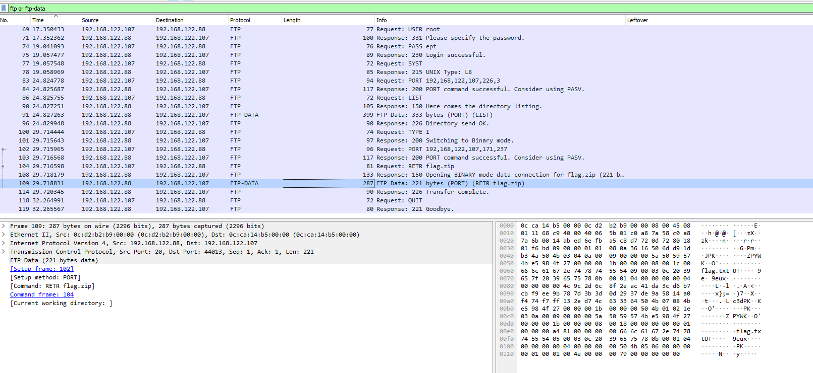
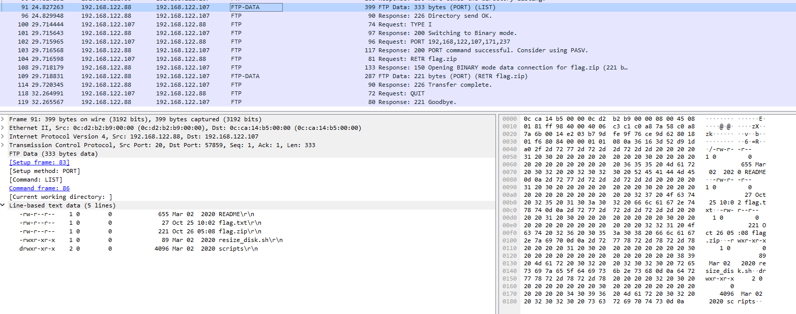
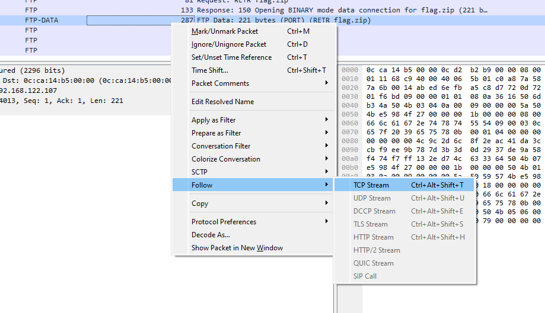
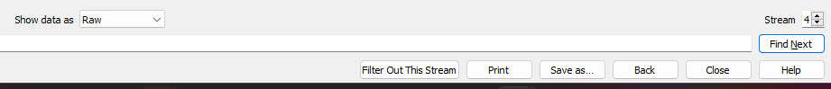
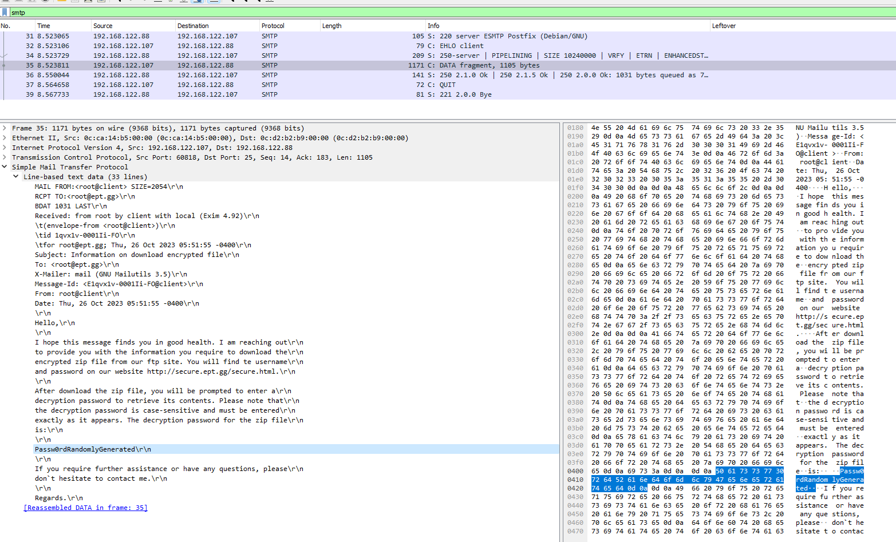

# Secured Exchange
Author: BeerMount

Flag: `EPT{DuDe_WheRe_Is_My_FlAg}`
## Description
```
Our financing department has developed their own ultra secure methods of transferring vital financial reports. 
See if you can find a flaw in their plan
```

## Provided challenge files
* [secured.pcap](secured.pcap)


## Writeup

Opened the PCAP file in WireShark and saw some HTTP Requests to [secure.html](secure.html):



It hints to a FTP so I change the filter to FTP and see this:



I see they are downloading a list of files and a flag.zip



So I follow the tcp stream to get all the data and convert to raw and downloads it as [flag.zip](flag.zip)




Trying to unzip the file shows that it is password protected:

```bash
└─$ unzip flag.zip 
Archive:  flag.zip
[flag.zip] flag.txt password: 
```

Looking for more in the dump I see a mail there in there it tells me a password:



And unzipping with that gives me [flag.txt](flag.txt)