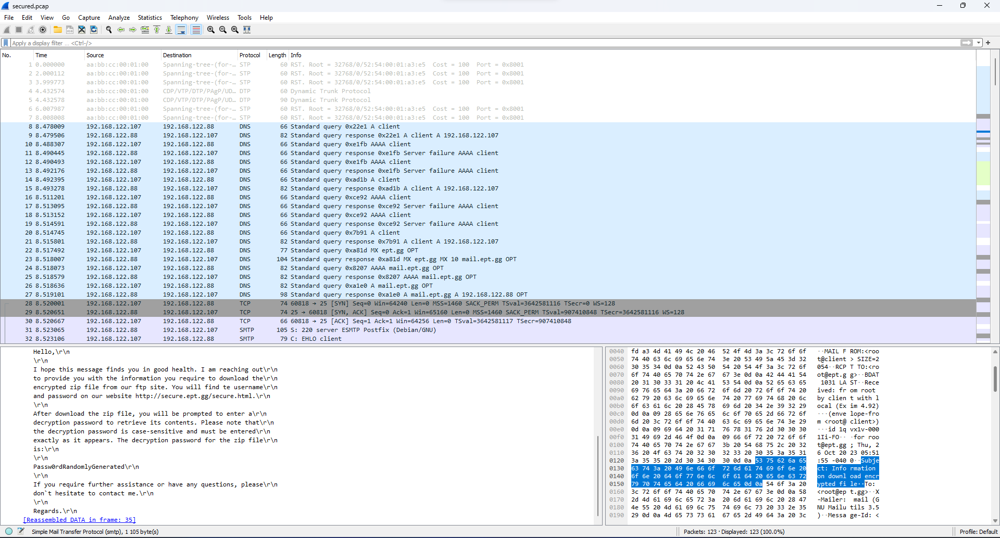
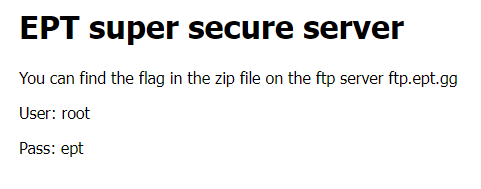
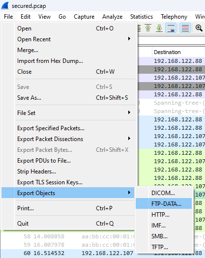

# Secured Exchange
Author: BeerMount

Flag: `EPT{DuDe_WheRe_Is_My_FlAg}`
## Description
```
Our financing department has developed their own ultra secure methods of transferring vital financial reports. 
See if you can find a flaw in their plan
```

## Provided challenge files
* [secured.pcap](secured.pcap)


## Writeup

The PCAP provided for this task is quite small, making it possible to simply skim through the entries and get an overall understanding of its contents. Opening it in WireShark immediately reveals a DNS request for the MX record of ```ept.gg```, followed by some SMTP traffic containig an email towards the same domain in clear text, as shown in the picture below.



The content of this email reveals the mechanics behind the "secured exchange" going on in this PCAP:

```
Hello,

I hope this message finds you in good health. I am reaching out
to provide you with the information you require to download the
encrypted zip file from our ftp site. You will find te username
and password on our website http://secure.ept.gg/secure.html.

After download the zip file, you will be prompted to enter a
decryption password to retrieve its contents. Please note that
the decryption password is case-sensitive and must be entered
exactly as it appears. The decryption password for the zip file
is:

Passw0rdRandomlyGenerated

If you require further assistance or have any questions, please
don`t hesitate to contact me.

Regards.
```

Naturally, the user thereafter accessess http://secure.ept.gg/secure.html, which provides the user with these instructions.



The PCAP thereafter shows FTP traffic to ```ftp.ept.gg```, and transfer of the file ```flag.zip```. We can extract this file from the PCAP in WireShark with the following tool:



Extracting ```flag.zip``` demands a password, which we from the email already have revealed as ```Passw0rdRandomlyGenerated```. The archive extracts into a file named ```flag.txt```, with the following content:
```
EPT{DuDe_WheRe_Is_My_FlAg}
```
