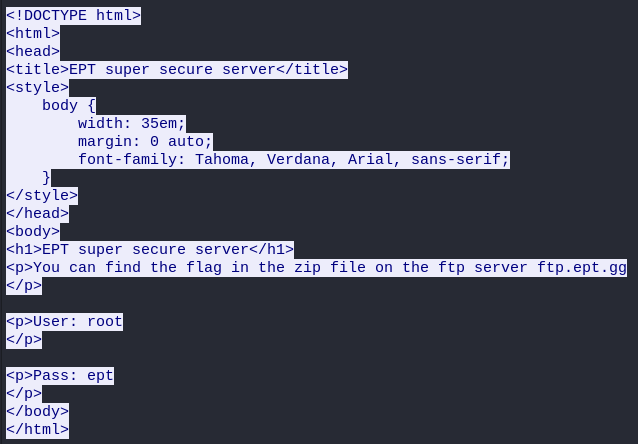
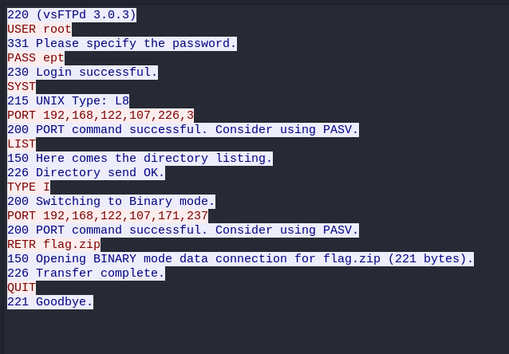
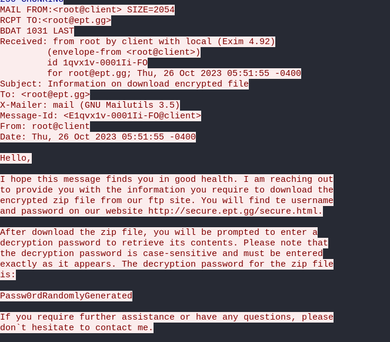
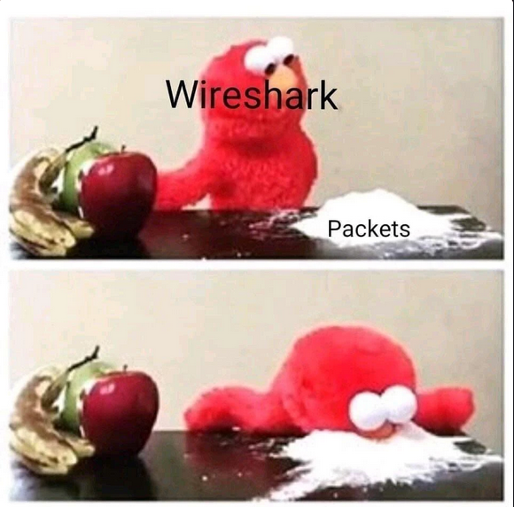

# SECURED EXCHANGE
**Author:** BeerMount

**Challenge Description:**  
Our financing department has developed their own ultra-secure methods of transferring vital financial reports. See if you can find a flaw in their plan.

---

## Solve
**By OsloLosen**

The "SECURED EXCHANGE" challenge was an engaging and straightforward task that involved delving into network traffic analysis using Wireshark.

### Initial Analysis:
We were provided with a pcap file containing a mix of DNS, SMTP, HTTP, and FTP traffic. Our initial focus was on the HTTP traffic, which revealed a GET request to `secure.ept.gg` for an HTML file.

This file indicated that the flag resided on the FTP server `ftp.ept.gg`. Rather than attempting to directly access the FTP server, we chose to scrutinize the FTP traffic within the pcap file.

### Discovery in FTP Traffic:
In the FTP traffic, we discovered the transfer of a zip file.

Instead of logging onto the FTP server, we extracted the zip file directly from the pcap data. However, we encountered a hurdle: the zip file was password-protected.

### Uncovering the Password:
Returning to the beginning of our analysis, we noticed an email being sent over SMTP.

This email contained the crucial piece of information we needed – the password for the zip file. With this password, `Passw0rdRandomlyGenerated`, we were able to unlock the zip file.

### Retrieving the Flag:
Upon unzipping the file and applying the discovered password, we successfully accessed the contents and retrieved the flag.

#### Flag: `EPT{DuDe_WheRe_Is_My_FlAg}`
