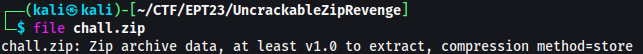
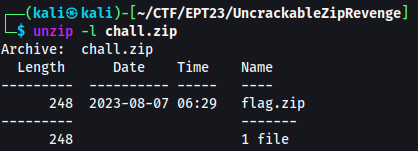
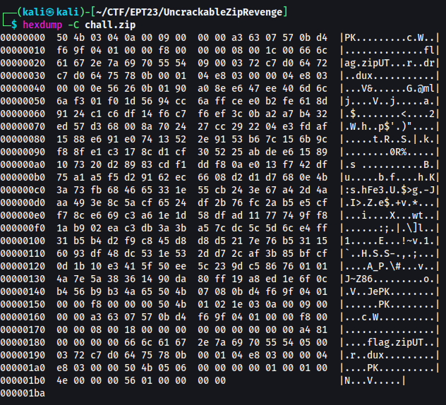
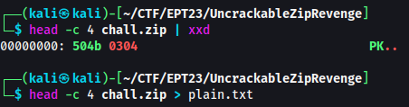
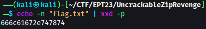
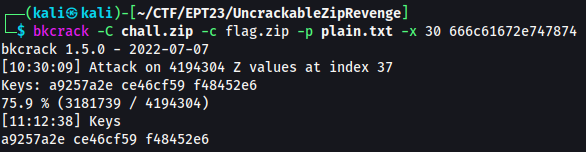
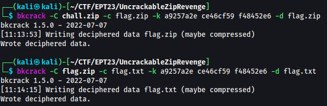
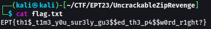

# Uncrackable Zip Revenge

## Description
``` 
I heard that packing things twice makes it really secure, even if we use the same password. This time it surely is uncrackable.
```
## Provided challenge files
* [chall.zip](../chall.zip)

# Writeup

## Enumeration

To begin, I used `file chall.zip` for an initial analysis of the provided challenge file. It revealed that it is a ZIP archive with the compression method set to 'store'. This indicates that the files within the ZIP archive are stored without compression.


_Figure 1 - Initial analysis of `chall.zip`_

Next, I executed `unzip -l chall.zip` to list the files inside the archive. As depicted in Figure 2, it contains a single file named `flag.zip`. Given the challenge's premise that double packing enhances security, it's logical to conclude that the flag is inside `flag.zip`. While one approach would be to extract and crack the hash, the challenge's hint about double zipping suggests a different method might the intended way. 


_Figure 2 - Displaying the contents of the archive_

In Figure 3, a hexdump of `chall.zip` shows the ZIP file beginning with the magic bytes `50 4b 03 04`. The file name of the contents is stored at offset 30, aligning with the standard ZIP file format as detailed on [Wikipedia](https://en.wikipedia.org/wiki/ZIP_(file_format)#File_headers).


_Figure 3 - Hexdump of `chall.zip`_

## Exploit

In 2005, Eli Biham and Paul C. Kocher demonstrated in their paper[^paper] that the PKZIP stream cipher is susceptible to a known plaintext attack. The bkcrack tool[^bkcrack], which exploits this vulnerability, was the key to solving this challenge.

> `bkcrack` requires at least 12 bytes of known plaintext, with a minimum of 8 consecutive plaintext bytes.
{: .prompt-warning }

Assuming the nested structure `chall.zip > flag.zip > flag.txt`, we know the first 4 bytes of `flag.zip` are `50 4b 03 04`. We also expect the string `flag.txt` (`66 6c 61 67 2e 74 78 74`) at offset 30, providing us with 12 bytes of plaintext, 8 of which are consecutive. This sets the stage for using bkcrack.

First, I created a plaintext file with the ZIP file magic bytes, as shown in Figure 4.


_Figure 4 -  Preparing a plaintext file for bkcrack_

Additional plaintext at a specific offset can be added using `-x <offset> <plaintext in hex>`.


_Figure 5 - Determining the hex representation of `flag.txt`_

I initiated bkcrack with the following command:

```bash
bkcrack -C chall.zip -c flag.zip -p plain.txt -x 30 666c61672e747874
```

Successful cracking of the internal encryption keys was confirmed, as shown in Figure 6.


_Figure 6 - Successful cracking of the encryption keys_

Given that the same password was used for both ZIP files, the same internal keys could decrypt both. The decryption process is as follows:

```bash
# Decrypting chall.zip
bkcrack -C chall.zip -c flag.zip -k a9257a2e ce46cf59 f48452e6 -d flag.zip 
# Decrypting flag.zip
bkcrack -C flag.zip -c flag.txt -k a9257a2e ce46cf59 f48452e6 -d flag.txt
```


_Figure 7 - Successfull decryption of the zip files_


_Figure 8 - `flag.txt`_


`EPT{th1$_t1m3_y0u_sur3ly_gu3$$ed_th3_p4$$w0rd_r1ght?}`

> **Tip:** The bkcrack tool does not need a file as an input for plaintext. It also works with:
```bash
bkcrack -C chall.zip -c flag.zip -x 0 504b0304 -x 30 666c61672e747874
```
{: .prompt-info }


## References
[^bkcrack]: <https://github.com/kimci86/bkcrack>
[^paper]: <https://link.springer.com/chapter/10.1007/3-540-60590-8_12>
