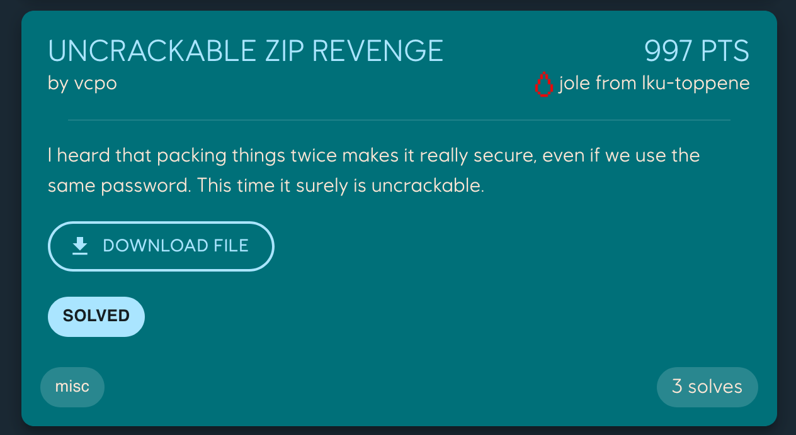
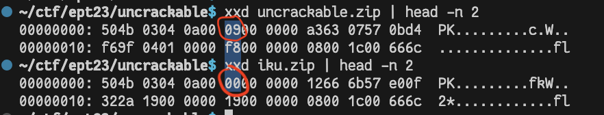
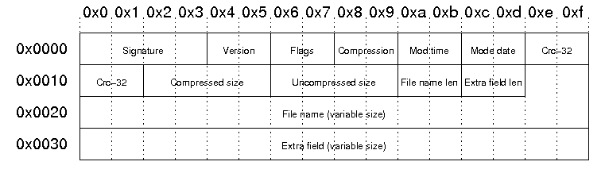

# Uncrackable Zip Revenge
Author: `vcpo`

Category: `misc`

[Original writeup](https://github.com/joleeee/writeups/tree/main/writeups/2023-ept/uncrackable-zip-revenge)



> I heard that packing things twice makes it really secure, even if we use the
> same password. This time it surely is uncrackable.

In this task we get a zip with a password, which contains a zip with a text
file, but that zip also has the same password.

## Initial recon
I instantly think of [bkcrack](https://github.com/kimci86/bkcrack)
([tutorial](https://github.com/kimci86/bkcrack/blob/master/example/tutorial.md)),
which we can use to crack zips which use bkcrypt. Since there is a zip inside
the first zip, we can hope there is enough of the header that stays constant
that we know enough plaintext bytes.

We can make our own zip and inspects its bytes, and then hope the zip inside the zip has the same bytes.

## Script to find equal bytes

I first made a fake flag, then double zipped it. I also then took the provided
zip and uses that as well. This script i wrote printed which bytes are equal:

```sh
#files = [open(f, "rb").read()[:100] for f in ["iku.zip", "uncrackable_zipped.zip", "uncrackable.zip", "random.zip", "hints.zip", "libc.so.6.zip"]]#, "jsonbourne.zip"]]
files = [open(f, "rb").read()[:100] for f in ["iku.zip", "uncrackable.zip"]]

found = []

for i in range(30):
    first = files[0][i]
    equal = all(file[i] == first for file in files)
    if equal:
        print(f"{i}: 0x{first:x}")
        found.append((i, first))

print("total found", len(found))

for (offset, value) in found:
    print(f"-x {offset} {value:02x}", end=" ")
```

As you can see i also initially tried a lot of random zips i found in my
downloads folder, but at least one of them was very different, and i noticed if
i zipped on mac then the version was different than on my linux box.

I ended up just using those two zips in the final working payload.

If we run that program, we get arguments we can use with bkcrypt:

```sh
$ python3 similar.py 
0: 0x50
1: 0x4b
2: 0x3
3: 0x4
4: 0xa
5: 0x0
7: 0x0
8: 0x0
9: 0x0
13: 0x57
20: 0x0
21: 0x0
23: 0x0
24: 0x0
25: 0x0
26: 0x8
27: 0x0
28: 0x1c
29: 0x0
total found 19
-x 0 50 -x 1 4b -x 2 03 -x 3 04 -x 4 0a -x 5 00 -x 7 00 -x 8 00 -x 9 00 -x 13 57 -x 20 00 -x 21 00 -x 23 00 -x 24 00 -x 25 00 -x 26 08 -x 27 00 -x 28 1c -x 29 00 %                       
```

Unfortunately that wont just work:
```
~/ctf/ept23/uncrackable$ bkcrack -C uncrackable.zip -c flag.zip -x 0 50 -x 1 4b -x 2 03 -x 3 04 -x 4 0a -x 5 00 -x 7 00 -x 8 00 -x 9 00 -x 13 57 -x 20 00 -x 21 00 -x 23 00 -x 24 00 -x 25 00 -x 26 08 -x 27 00 -x 28 1c -x 29 00
bkcrack 1.5.0 - 2023-11-11
Data error: not enough contiguous plaintext (7 bytes available, minimum is 8).
```

We need at least 8 contigous bytes of plaintext, so lets figure out what they mean. I see that bytes 0..=5 and 7..=9 are known, so if we find byte 6, we're good.



Seems like it's `00` in my zip and `09` in the provided zip. Using https://users.cs.jmu.edu/buchhofp/forensics/formats/pkzip.html we can get this pretty table which I used in the early stages where i tried crafting known pt myself:



Further down there we can see that:

```
Bit 00: encrypted file
Bit 03: data descriptor
```

And we know that
```py
>>> 2**0 + 2**3
9
```

So I'll guess this has to be `09` (in reality I ran both at the same time before I figured this out).

Then I went to the toilet because it looked like it would take forever anyway, and when I came back:

```sh
$ ./bkcrack -C uncrackable.zip -c flag.zip -x 0 50 -x 1 4b -x 2 03 -x 3 04 -x 4 0a -x 5 00 -x 6 09 -x 7 00 -x 9 00 -x 13 57 -x 21 00 -x 25 00 -x 27 00 -x 29 00
bkcrack 1.5.0 - 2022-07-07
[20:11:23] Z reduction using 1 bytes of known plaintext
100.0 % (1 / 1)
[20:11:23] Attack on 2555904 Z values at index 6
Keys: a9257a2e ce46cf59 f48452e6
68.1 % (1740598 / 2555904)
[20:15:47] Keys
a9257a2e ce46cf59 f48452e6
```

Woo! Then just decrypt and hope the key is the same for the inner zip 🤞.

```sh
$ ./bkcrack -C uncrackable.zip -c flag.zip -k a9257a2e ce46cf59 f48452e6 -d flag_extacted.zip
bkcrack 1.5.0 - 2022-07-07
[20:16:28] Writing deciphered data flag_extacted.zip (maybe compressed)
Wrote deciphered data.

$ ./bkcrack -C flag_extacted.zip -c flag.txt -k a9257a2e ce46cf59 f48452e6 -d flag_extracted.txt
./bkcrack -C flag_extacted.zip -c flag.txt -k a9257a2e ce46cf59 f48452e6 -d flag_extracted.txt
bkcrack 1.5.0 - 2022-07-07
[20:16:46] Writing deciphered data flag_extracted.txt (maybe compressed)
Wrote deciphered data.

$ cat flag_extracted.txt 
EPT{th1$_t1m3_y0u_sur3ly_gu3$$ed_th3_p4$$w0rd_r1ght?}
```

Flag: `EPT{th1$_t1m3_y0u_sur3ly_gu3$$ed_th3_p4$$w0rd_r1ght?}`

## Thoughts
Fun task!!1
