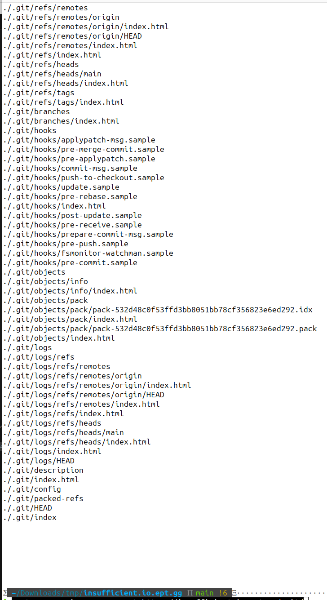
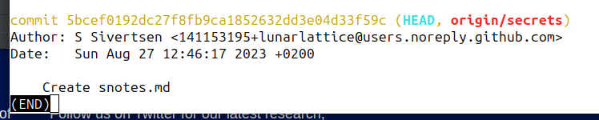

# Writeup
By Nikolas Papaioannou

When entering the webpage we simply hit a landing page with nothing on it.

As the description has the line: `When he left, he was mumbling something about a secret he had hidden in the git repo`

We can assume that there is a git repo somewhere, and that we need to find it. I simply guessed the .git is a browsable directory, and it was.

Normally a tool like dirbuster would be useful here.

Finding this git folder i wget it to my local machine, and start looking through the files.

```sh
wget --recursive --no-parent https://insufficient.io.ept.gg/.git/
```


Looking trough it there is a bunch of extra index.html files that got pulled too, so cleaning up them

```sh
find . -iname index.html | xargs -f
```

Seach for commits containing the crib of the flag and got a hit:

```sh
git log --all -G 'EPT\{'
```



Then i simply read the content of the snotes.md file

```
cat snotes.md
# secret notes

moved!

EPT{1n5uff1c13n7_cr3d3n7141_hy613n3}

need a place to take notes.

this paste is `.bash_history` from the sunshine deployment we removed, just make life easy and reuse the steps when deploying... they work!
```
ssh-keygen -t ed25519 -C "lunarlattice" -f github_deploykey
ssh -i github_deploykey -T git@github.com
cat github_deploykey.pub
GIT_SSH_COMMAND='ssh -i github_deploykey' git clone git@github.com:lunarlattice/sunshine.git
cp * sunshine && cd sunshine
chown -R "$USER":"$USER" * && chmod -R 644 *
nano Dockerfile
docker build -t sunshine . && docker run --rm -it sunshine -p5000:5000
```

@todo need a place to paste my secrets, it can not be in the main branch so find somewhere else...
```

**Flag:** `EPT{1n5uff1c13n7_cr3d3n7141_hy613n3}`