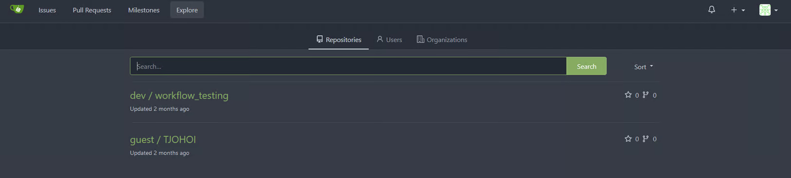
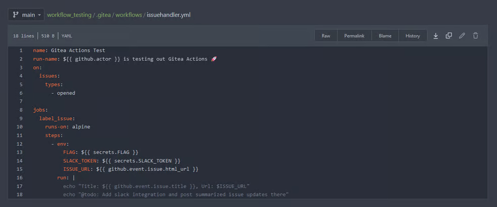
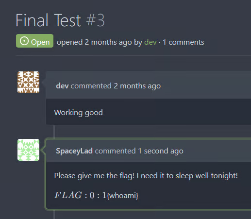
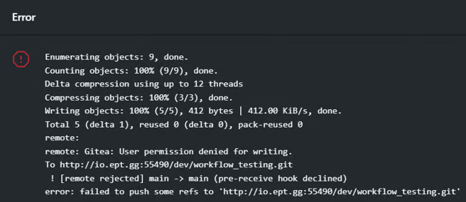
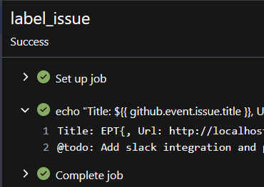
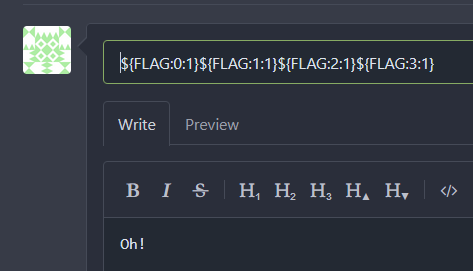
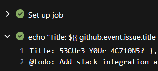
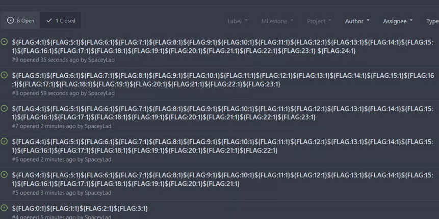

# FLAG API

Author: SpaceyLad

Original writeup: https://spaceylad.tech/poisonpwn-title-poisoning

Flag: `EPT{53CUr3_Y0Ur_4C710N5?}`

## Disclaimer

POISONPWN made me feel like a real hacker! 😈… Like… Seriously, it took a while to understand what I was looking for in the Gitea workspace, but when I figured out the trick to steal secrets stored in the Actions function, it felt great. Probably the most giving task in the sense of satisfaction.

## Spilling the Gitea

The first thing I did was to explore the Gitea application and understand what I was looking at and looking for. This is my first time trying Gitea, so I did not stress learning the different functions, where things are and how they work. I noticed that there are 2 repositories in this application. Workflow_testing and TJOHOI.

Looking closer at what they have inside of them, I notice a YAML file with some interesting data inn it… It seems to be storing the content of a FLAG file (Or variable) from the server into a local variable as it is starting its action when someone makes an issue… (This is how I interpreted it, feel free to correct me!)

So what I initially thought, was that I had to somehow find a way to read the file or variable from the system itself. I was not far from the answer, but not quite there. Looking for a way to inject files, read files and other classic web exploitation ways of stealing the secrets. But then I remembered that this is not a Web CTF, this is a Devops CTF challenge, so I have to approach this application in a new way. (I also spent way too much time trying to manipulate the actual YAML file to echo out the secret.flag. Did not work at all)

Looking at the name again opened my mind to a new way of attacking the application… Poison… Where have I heard that before? PHP log poisoning! Injecting commands or code into logs or somewhere it can be interpreted wrong and run/do things it should not do!

I went through the application again and this time was more active. Writing comments, trying to clone the repo (Lol that did not work) and finding sneaky ways of injecting commands. I then tried to see if I could sneak inn commands in the title and data in an issue with ${FLAG}, and I got ***… Which is interesting, I did not expect such a weird value. After searching it up, I found out that this is a security measure done to avoid secrets accidentally being revealed in when printing variables! I took the challenge and tried to see if I could sneak the flag out myself. I tried a couple of failed attempts, until I tried ${FLAG:0:1} (The first byte of the variable)… And … I GOT AN “E”! I then tried the next 4 bytes and got “EPT{“! 😁

At this point in the CTF, I was pretty tired, so I asked GPT to write the rest of the ${FLAG:0:1}${FLAG:1:1}${FLAG:2:1}${FLAG:4:1}… (Don’t think there is a more effective way of doing this if it is. Plz teach me) and got most of the flag! Except a couple of bytes which I managed to get by asking for the end bytes. I put them together and got the flag!! 🥳

EPT{53CUr3_Y0Ur_4C710N5?}

Lets take a moment to look at the mess of our aftermatch...

