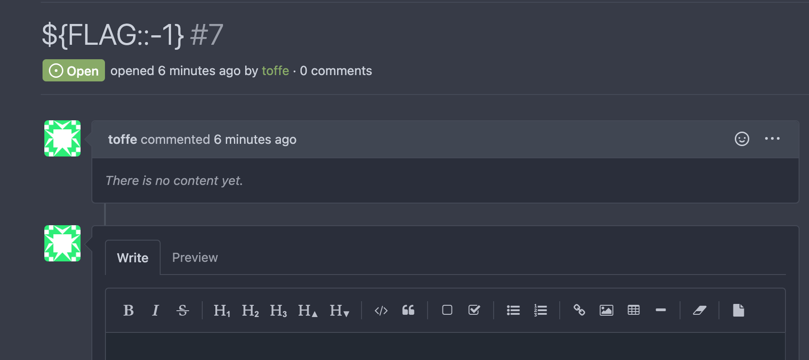
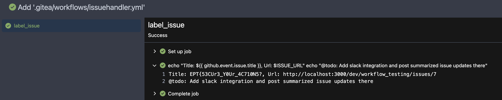

# poisonpwn
Author: starsiv

Flag: `EPT{53CUr3_Y0Ur_4C710N5?}`
## Description
```
CICD's automation is great and comfy but I sense a chilly draft. Can you find the way in?
```

## Writeup

Looking at the open repositories available one of them runs a github action script as shown below.

```yaml
name: Gitea Actions Test
run-name: ${{ github.actor }} is testing out Gitea Actions 🚀
on:
  issues:
    types:
      - opened

jobs:
  label_issue:
    runs-on: alpine
    steps:
      - env:
          FLAG: ${{ secrets.FLAG }}
          SLACK_TOKEN: ${{ secrets.SLACK_TOKEN }}
          ISSUE_URL: ${{ github.event.issue.html_url }}
        run: |
          echo "Title: ${{ github.event.issue.title }}, Url: $ISSUE_URL"
          echo "@todo: Add slack integration and post summarized issue updates there"
```

This github action will be run on each new issue created. You can see the title of the issue will be echo'ed in the linux alpine docker image. We also see the flag beeing added as envirnoment variable.

So whatever I put in the title will be run within an `echo` command. So if I put int `$FLAG` as the title the commands will be:

```bash
echo "Title: $FLAG, Url: $ISSUE_URL"
echo "@todo: Add slack integration and post summarized issue updates there $FLAG:"
```

Which will print the secret. But github will sensor that and replace it with `***` so we need to find a way to bypass that. My first thought was to just remove one character and that worked flawlessly: (`${FLAG::-1}`)



And looking in the actions log I get this:



Now just add the character I removed `}` and I get the flag! 
