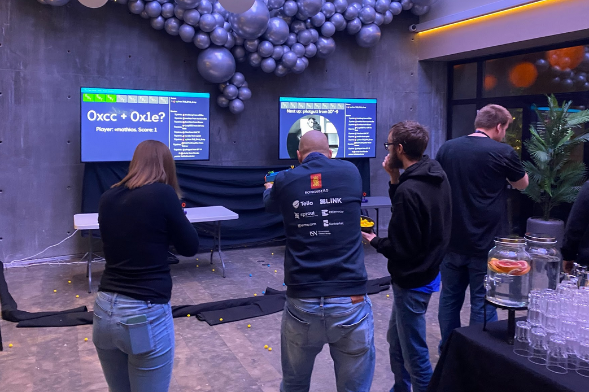
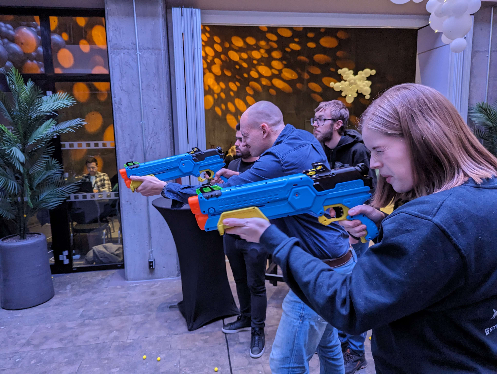
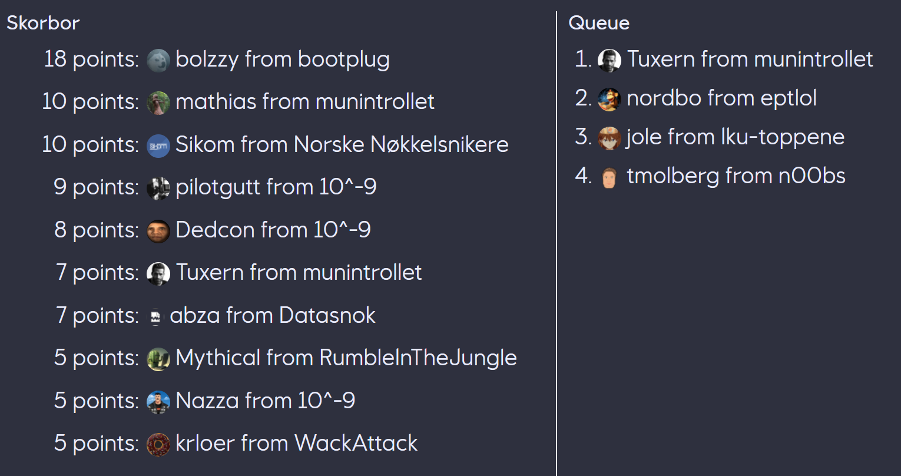

# EPT CYBER RANGE
**Authors:** tmolberg and nordbo

**Description:**
Rumored to be the best Cyber Range in Norway. Participants can join the queue using `/join-queue` on the Discord server. To secure the flag, you need to score three or more points. 

The top 3 overall will receive an EPT coin.

---

## Solve
**By mathias, Lise??, & Tuxern**



### Challenge Mechanics
In this unique challenge, participants were equipped with two guns loaded with 10-15 "soft bullets." The objective was to shoot down an 8-bit binary combination. This combination was derived from the addition of two hexadecimal numbers displayed on a screen. Each participant had 30 seconds to perform the calculation mentally and then accurately hit the corresponding targets. Each successful attempt earned one point. The challenge continued until an incorrect number was hit or time ran out.

You had an infinite amount of ammo, but you had to reload at strategic points in order to be succseful within the timelimit



### Our Experience
We achieved first blood in this challenge, a testament to our quick calculation and sharpshooting skills. However, maintaining our position at the top of the leaderboard proved challenging due to the degradation of the electronics. This malfunction led to errors and random resets, especially when participants were on a winning streak.



I can with the uttermost confidence say that we would have beaten bootplug if the electronics were working as intended, but at this time the only thing we can do is congratulate bootplug on their highscore of 18.

### Strategy Employed
Our analyst mathias employed a specific strategy for calculating the correct binary combination: 

- Sum the least significant bits, remembering any carryover.
- Convert this sum to binary and assign names to the targets.
- If necessary, include the carryover and sum the most significant bits, converting this too into binary.

These techniques primarily involved mental arithmetic tricks, such as adding 'F' and then subtracting one to generate a carryover.

### Pseudo Code Explanation
To further elucidate the thought process, here's a pseudo code in Python:

```python
tall1 = input()
tall2 = input()
mente = False
summen = tall1 + tall2
shoot = []
if summen >= 16:
  mente = True
  summen -= 16
if summen % 2 == 1: # Check for odd number
  shoot.append(0)
if summen >= 8:
  shoot.append(3)
  summen -= 8
if summen >= 4:
  shoot.append(2)
  summen -= 4
if summen >= 2:
  shoot.append(1)
print(*shoot)
```

This code effectively mirrors the strategic approach used in the challenge, facilitating the rapid computation and decision-making necessary to excel.

In order to get the flag you had to reach a streak of 3, which we easily did by employing our state of the art tactics. 

`Flag: EPT{LOLASL}`
