  # NOAH’S ARK
**Author:** Mattis  

## Description
Solve the puzzle and save all the animals. Show the solved puzzle to EPT staff to receive flag.

You will receive a random puzzle to solve from a pool of puzzles of similar difficulty.

RULES:
- Do not bring a phone to the IQ puzzle area. There will be severe consequences point-wise if you are caught haxxing.
- You can collaborate with others from your team.
- If you, or anyone from your group/team leaves the puzzle area, you must turn in the puzzle sheet and forfeit your attempt. On re-entry, you will receive a new random puzzle to solve from the pool.

## Solve
**By mathias & Lise??**

Noahs ark puzzle is really simple, so simple that one might even say ~a five-year-old~ coldboots will solve it.

### Basics
Rules are simple: you start with 2 animals on the grid. All animals must end up next to its kin, or the other piece of the same color. And all spaces must be filled, and all pieces placed. The sharp-eyed might notice that the width and height of the spaces is different. That means that each individual piece can only be placed in one singular way as all animals should be placed upright.

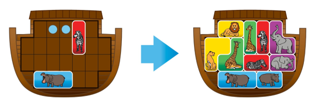

The first conclusion one can draw is that each piece is either 2 or 3 spaces big. In combination they make a variety of forms as shown below:

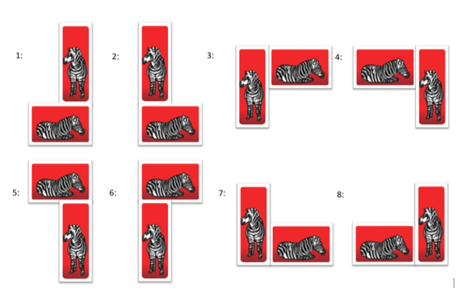

Starting the puzzle
For example, for the task shown above, then the only valid pentominoes are 1, 2, 4, 7 and 8. 7 is invalid cause it leaves a single free space in the corner. And 2 is invalid cause it leaves 4 free spaces in the corner. Where one would need 5 spaces to make a pentomino. This leaves us with only 3 options which can then be tested 1, 4 and 8.

The trick then is to always look for the more restricting cases then rule them out. For example, using pentomino number 8 will lead to a very hard spot to fill.

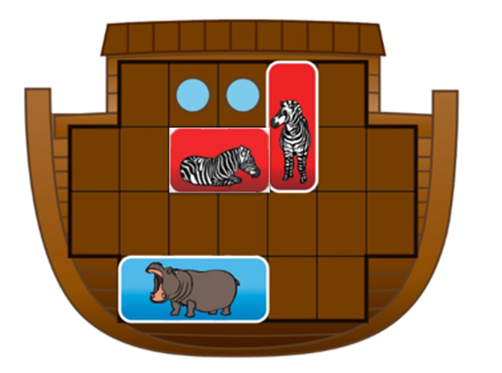

A quick look through the remaining pieces leads us to the fact that it’s impossible to fill.

Then testing the zebra horizontal number 4 option.

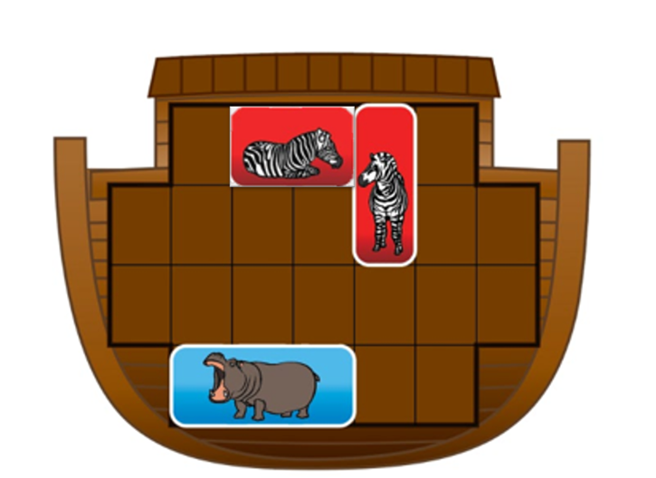

Where one would start to reduce the options, here is the second blue piece. It has 5 options.

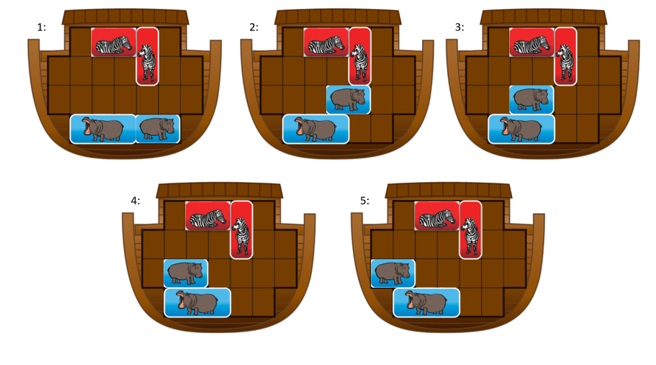

All remaining pairs contain 5 spaces, aka pentominoes. Both option 2 and 3 split the grid into two sections. Where the size of the right side of the ark has 6 or 7 spaces. Which can’t be made of pentominoes.

Option 4 looks very restrictive and since we know that it’s built from pentominoes we can find where the pentominoes are.

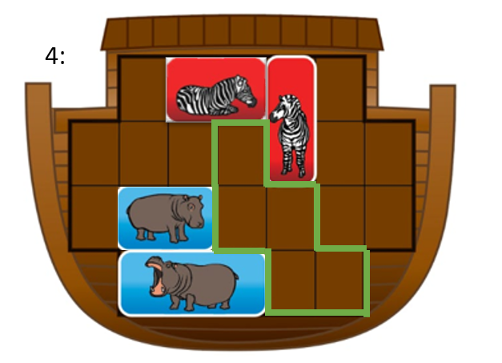

Quick testing results in that the lion pieces can’t be placed into any of these pentominoes.

Option 5 we can also find the pentominoes.

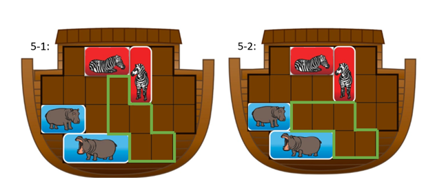

In both options the Lion pieces doesn’t fit in any pentomino.

Only remaining option is the 1 placement of the 2-space hippo.

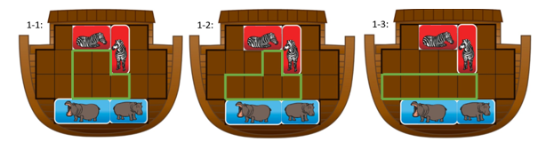

Lion doesn’t fit in either 1-2 or 1-3. While nothing can fill the left side of the ark on 1-1.

This excluded the last option for the placement of the horizontal zebra piece in position 4.

Last to check would be placement number 1 of the horizontal zebra. Which means both sides must contain a number of spaces which is divisible by 5.

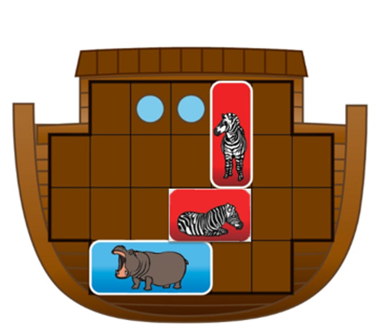

Now we have 10 spaces on the left, which is a multiple of 5. While we have 7 on the right, which means that the second blue tile must be put in the corner to make the remaining spaces 5 on the right.

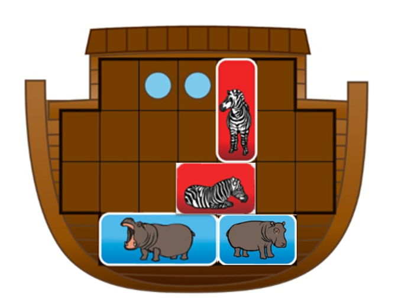

A lot can happen on the left side of the ark, so I would start on the right side. Through some quick testing we find the only fitting pentomino is the purple with elephants or the giraffes.

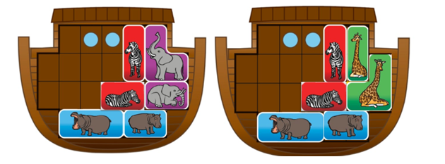

Then again find the most restricting piece, which would be the fewest options for placement. That would be the yellow lioness piece:

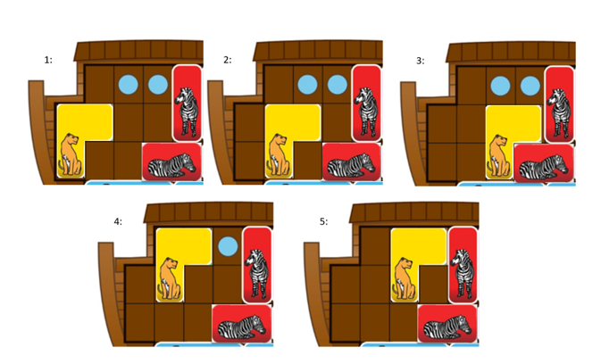

We can immediately rule out 2 and 5 as they leave one space trapped.

### Just test every combination

Number 4 can quickly be disproven, by not being able to place the Lion without trapping a space.

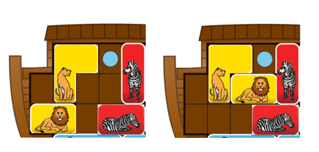

Number 3 is ruled out by not being able to place the giraffes.

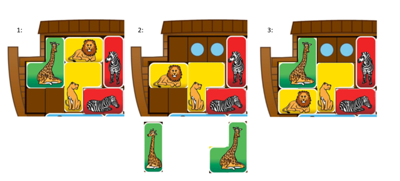

Number 1 and 3 can’t place the 2-space giraffe, while number 2 can’t place any giraffe pieces. In none of these can the elephant pieces be placed.

So only remaining configuration is the solution we are looking for:

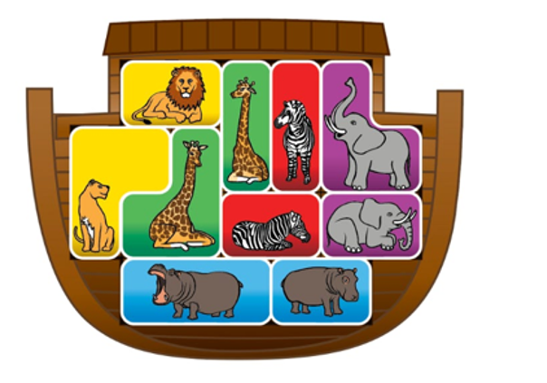

`EPT{puzzle_solv3r_megamind}`
