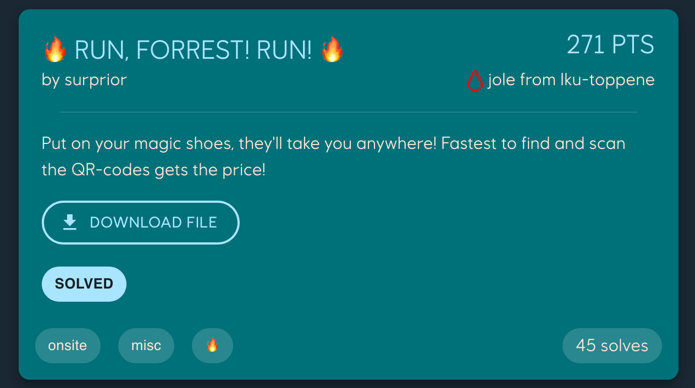
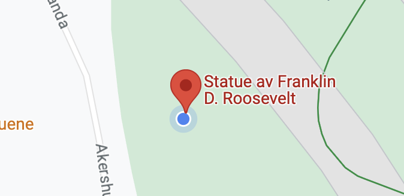
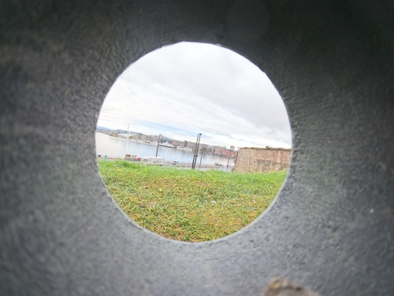
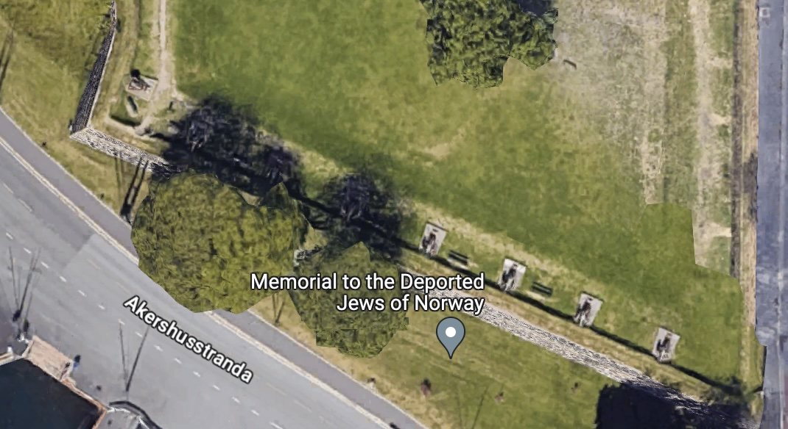
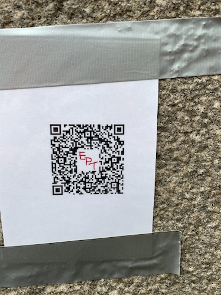
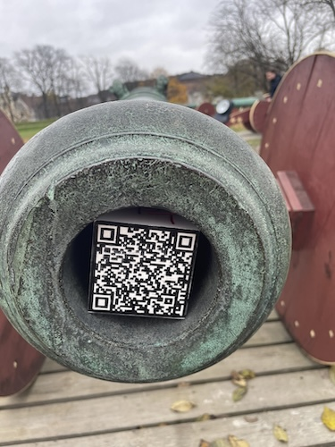
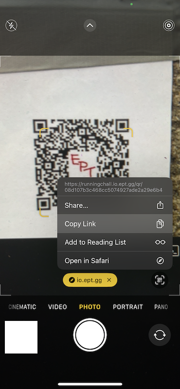
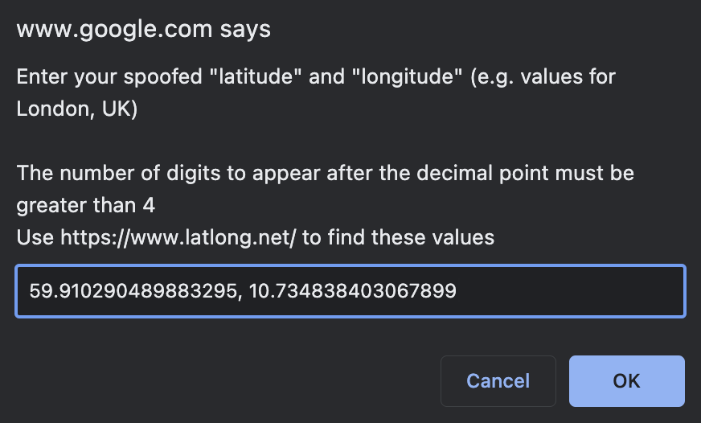
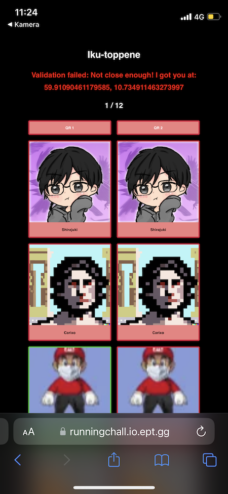
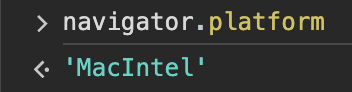

# 🔥 Run, Forrest! Run! 🔥
Author: `surprior`

Category: onsite, misc, fire

[Original writeup](https://github.com/joleeee/writeups/tree/main/writeups/2023-ept/run-forest-run)

> Put on your magic shoes, they'll take you anywhere! Fastest to find and scan the QR-codes gets the price!

This task consisted of finding two QR codes near the venue based on two images attached. We got first blood on this challenge, and was the only team who managed to solve it (just lucky for us, other teams hit bugs which made it unsolvable). First, the second QR code was not reedemable, so the challenge was pulled. It was later reinstated, after which we solved it, but it was broken for some teams. Eventually everyone on-site was awareded the challenge because it was deemed broken.

## Images
The images (scaled down) were

## First picture

This is a picture of Roosevelt, and corresopnds to somewhere around `(59.910290489883295, 10.734838403067899)`:

## Second picture

This second picture is a bit harder, but Tweey (Sondre) figured it it's around here `(59.90561505734309, 10.736696393572787)`:

## QRs
Sondre also then ran and took pictures of the QR codes

On iOS, if you scan this using the QR scanner it will automatically open, and if you then click the "open in safari" to escape the sandbox, the data from the qr is gone and you end up with errors. Instead you can use the camera and copy the link and use your computer:

We end up with two links:

1. `https://runningchall.io.ept.gg/qr/08d107b3c468cc5074927ade2a29e6b4`
2. `https://runningchall.io.ept.gg/qr/c00a92ab1f289180fa6357d2a2940ca6`

## Solve
Then we can just solve it by clicking those links while having an extension like [Spoof Geolocation](https://chrome.google.com/webstore/detail/spoof-geolocation/ihdobppgelceaoeojmhpmbnaljhhmhlc).

Then it's just a matter of clicking the correct link and putting the correct coordinates. The site is down now, but you get a popup like this:

.

The site looked like this (only screenhot i found):

You would know you managed it if your profile picture turned green. You can also see that each person would need to do it once for each qr.

The first time the second qr was also broken, so you can see Tweey beeing unable
to get points while he's actually at the right spot.

Then, once we all solved it, we got a red JSON message. It was quickly fixed and
the text turned green, and instantly the music playlist stopped 🫨

## Thoughts
For some reason this only worked on my computer, so everyone just sent me their session cookie and I did it for everyone. It turns out this is because I was on a mac, and there was some "anticheat" which blocked certain `navigator.platform` values, like `Win32`, but it did not check for `MacIntel` which is what all macs report.

All in all it was a cool challenge, and I did not even have to leave the venue! 😛

It's sad the challenge had to be pulled twice though, since it was a pretty
unique and fun one.