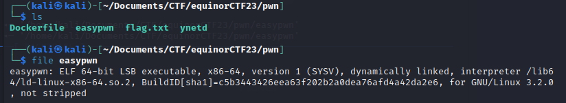
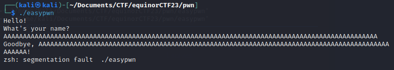
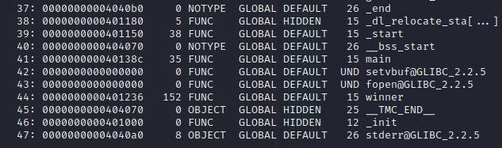
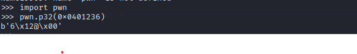
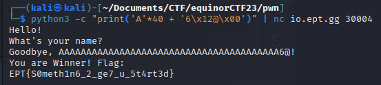

## Writeup

Som beskrivelsen sier er dette ment som en introduksjonsoppgave, og regner derfor med at det ikke er alt for avanserte teknikker involvert.

Etter å ha lastet ned og pakket ut oppgave-filene sitter vi igjen med en kjørbar ELF fil `easypwn`.

Kjører filen blir spurt om "What's your name?". Sender en rekke A'er, og får segmentation faul. Flott, vi har buffer overflow.

Bruker python for å produsere et gitt antall tegn, og prøver og feiler litt for å finne riktig grensen for når en får buffer overflow.
Finner at grensen er 40 tegn.

    python3 -c "print('A'*40)" | ./easypwn

Kjører readelf og sjekker om det er noen interessante steder vi har lyst å hoppe i koden. Ser at det er en funksjon som heter winner.

Bruker pwn.p32 for å gjøre om minneaddressen.

Smører det hele sammen og sender det til serveren som kjører programmet, og vipps der var flagget.

