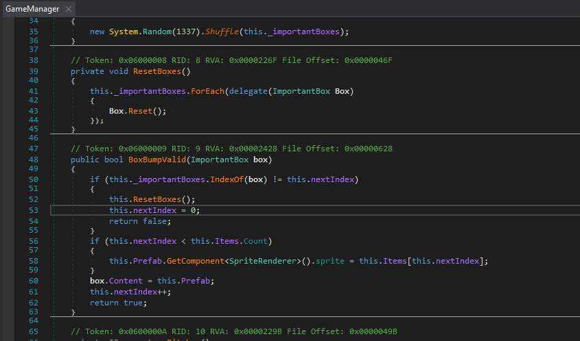
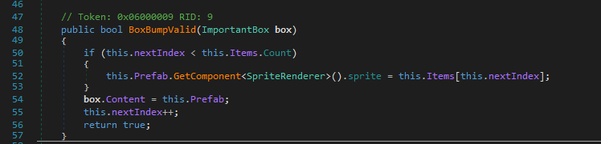
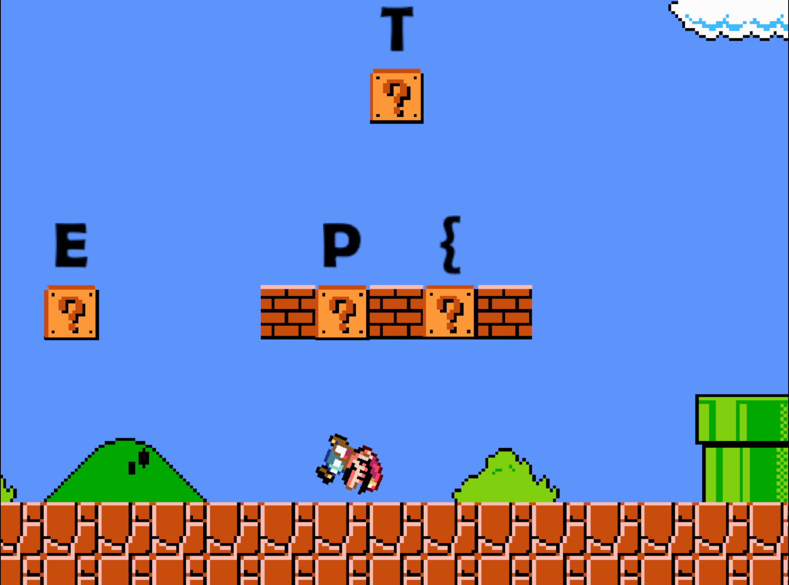

# Broken Mario writeup bootplug

In this challenge we are given a unity Mario clone game, with gamefiles for both linux and windows environments.
Naturally, we're opting for windows and trow `WINDOWS_broken-mario\EPT23-Challenge-Mario_Data\Managed\Assembly-CSharp.dll` containing the custom main game logic into DNSPY for dotnet decompilation.

After reviewing the core classes, our attention focused on the function `BoxBumpValid()` in the `GameManager` class which contains the logic for checking if the `?` box hit is "valid" according to the index initiated with a set seed.

However, as there is no checksum or validation of the game files, we can modify the code in DNSPY using rightclick -> `Edit Method (C#)` and remove the jumped box valid order check, making all boxes valid.

After compiling, we need to save the new file using `file -> save module`. 
We can now play the game, jumping on all boxes collecting the flag letters that appears over each box when bumped.
Keep in mind since all boxes are now valid, you need to note down the flag letters in the order you jumped the boxes on.

Flag: `EPT{1UiG!_w4$_h3R3}`
