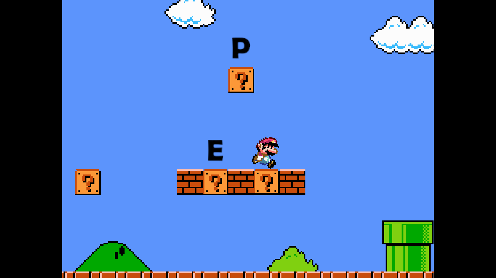
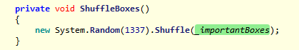
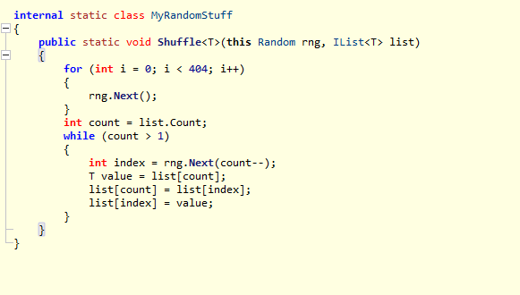

# Broken Mario - writeup

This is a game hacking challenge consisting of a unity based mario game. On simply playing the game, we discovered that the flags character appear by hitting the bricks in a certain order. 

There were 19 bricks in total and it was possible to brute force the pattern by trying all the bricks, but that required too much time since we would have to start over in case of hitting a wrong brick.

So, we looked in the source files to see if it gives away the pattern. Upon decompiling the Assembly-CSharp.dll, the function ShuffleBoxes stood out as interesting.

ShuffleBoxes createa a pseudo-random number generator with 1337 as seed and calls the Shuffle function that shuffles the characters of the flags in the bricks in some weird way. Since, we are only interested in the final output, we used the following script to pass an list of integer to the shuffling algorithm to get the final sequence.

    using System;
    using System.Collections.Generic;

    public class Shuffler
    {
        public static void Shuffle(List<int> list)
        {
            Random rng = new System.Random(1337);
        	for (int i = 0; i < 404; i++)
        	{
        		rng.Next();
        	}
        	int count = list.Count;
        	while (count > 1)
        	{
        		int index = rng.Next(count--);
        		int value = list[count];
        		list[count] = list[index];
        		list[index] = value;
        	}
        }
    
        public static void Main(string[] args)
        {
            List<int> integerList = new List<int>();
    
            // Adding integers from 1 to 19 to the list
            for (int i = 1; i <= 19; i++)
            {
                integerList.Add(i);
            }
            Shuffle(integerList);
            foreach (int number in integerList)
            {
                Console.Write(number+" ");
            }
        }
    }

This gave us the sequence `2 3 7 4 9 12 17 19 10 5 15 13 8 11 18 16 1 6 14` as output which is the order of bricks to hit. Now we just have to hit the bricks in this order to get the final flag i.e. `EPT{1UiG!_w4$_h3R3}`.

