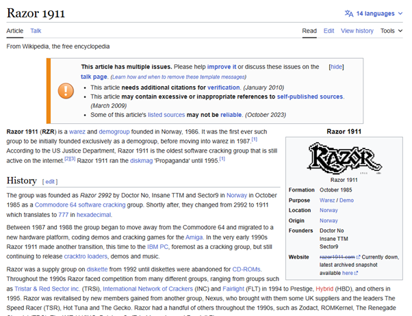
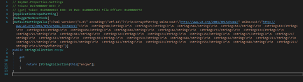
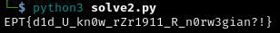

# EPT1911 - RE Writeup

**Task Description:**


After unzipping the file, we were given only 1 tool to work with which was the ***KeyGen.exe***


A weird key generator tool with title ***“Razor”***. Doing some light ***OSINT*** we find that razor is an actual tool used for keygen. 




We also find that it’s a *Norwegian demo group* since 1986.

**Time to Check the file!**

I see that it’s a tool compiled using ***.NET***. This is good news since we can use ***dnSpy*** to see the source code of the program.


*The source code*


*This checks if the computer is part of the domain contoso.com, then prints the flag.*



*The encoded part of the flag.*

**In summary**

This program checks if the machine is part of *contoso.com* domain. If it is, it will print *“EPT{“* along with the strings decoded from the *“Settings.Default.encpw”* code. For each character in encpw, it adds *42* and converts the character back to text. 

Knowing what to do next, I used this python script to decode the array of strings from *“encpw”* code back to text, as well as adding 42 in it.

```
encpw = ["58", "7", "58", "53", "43", "53", "65", "68", "6", "77", "53", "72", "48", "72", "7", "15", "7", "7", "53", "40", "53", "68", "6", "72", "77", "9", "61", "63", "55", "68", "21"]
flag = "EPT{"
for item in encpw:
    char_code = int(item) + 42
    flag += chr(char_code)
flag += "}"
print(flag)

```


**SIKE**

I got this flag, but it was wrong. I was stuck because I didn’t know if I was missing something, or if the server was having problems. That’s why I contacted the guys from the event and got a tip to make sure if I have the *“complete”* flag. Hmmmm…

I then went back to the source code and found the crucial part that I missed. 


This was the part of the code which adds *‘!’* to the end of the string, completing the flag.

```
encpw = ["58", "7", "58", "53", "43", "53", "65", "68", "6", "77", "53", "72", "48", "72", "7", "15", "7", "7", "53", "40", "53", "68", "6", "72", "77", "9", "61", "63", "55", "68", "21"]
flag = "EPT{"
for item in encpw:
    char_code = int(item) + 42
    flag += chr(char_code)
flag += "!}"
print(flag)

```


After running the new script, I finally got the correct ***flag!***

