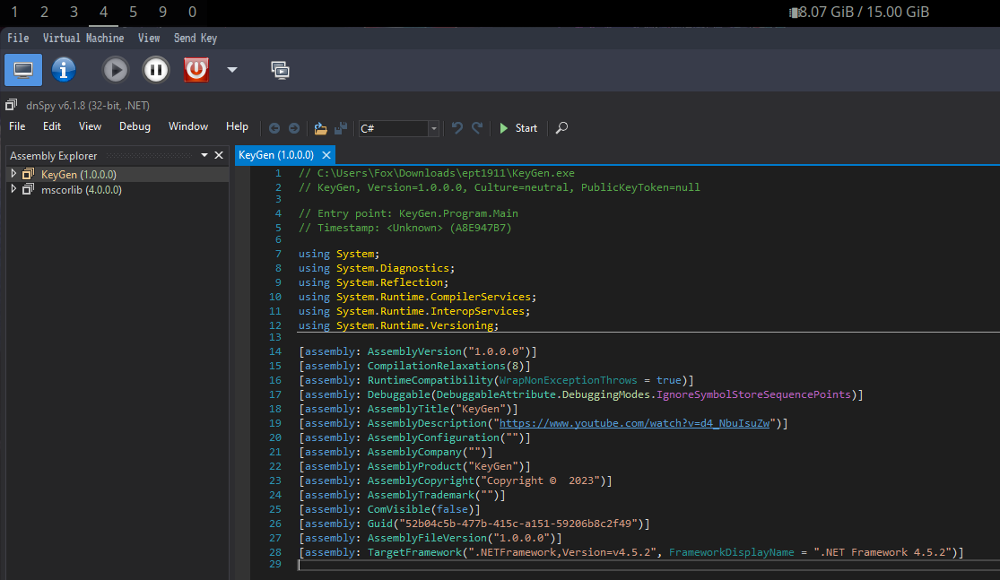
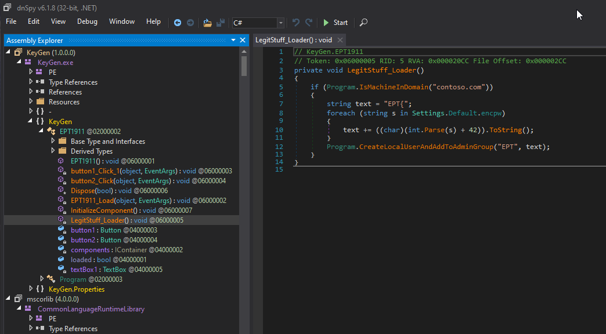
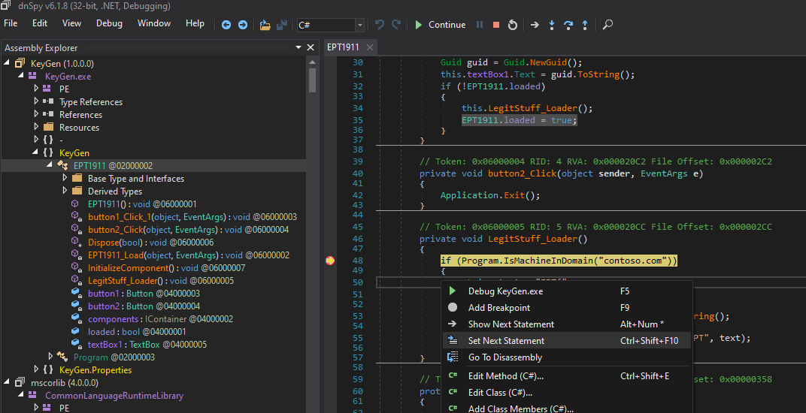
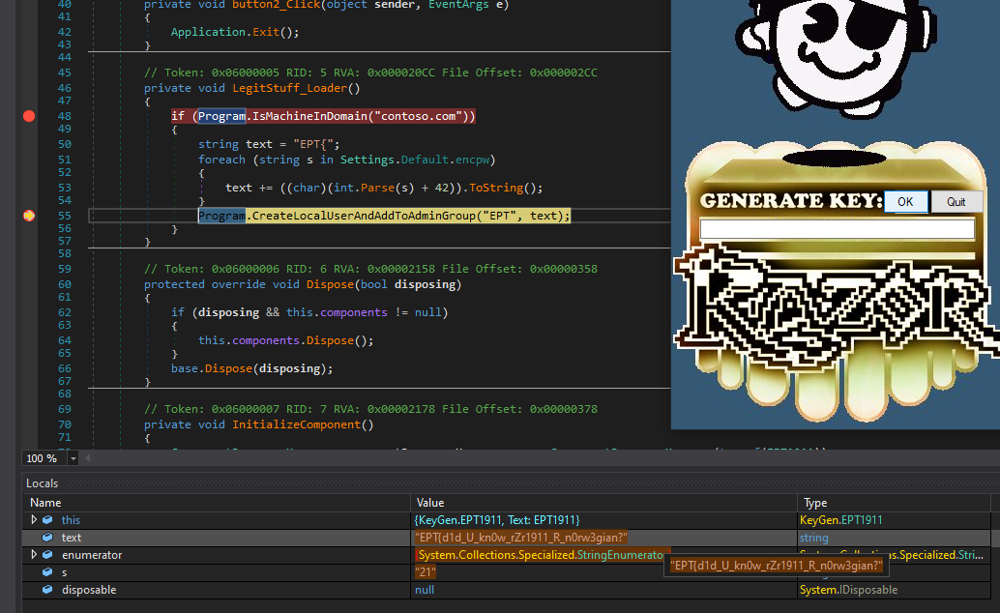
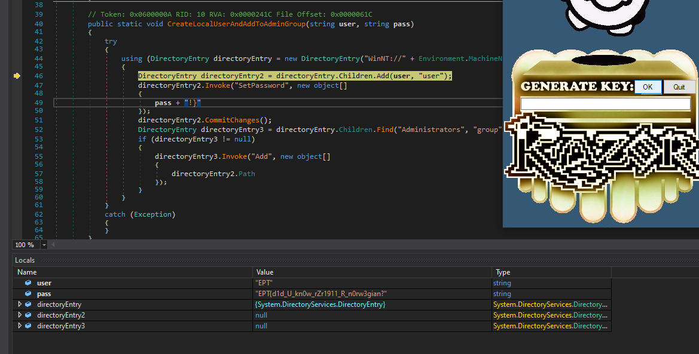

# EPT1911

Author: [FoxMaccloud](https://github.com/FoxMaccloud/)

Website: [Foxmaccloud.com](https://foxmaccloud.com/)

## Description

EPT1911 is a simple .net reversing challenge where you need to reverse engineer what looks to be a key generator. The application checks if you are in the domain `contoso.com` and will only attempt to give you the flag if these conditions are met by attempting to create a new domain user with the flag as the password.

## Analysis / DnSpy

The application is made in .net and can be decompiled using DnSpy.

After looking at the code, the function `LegitStuff_Loader()` immediately stands out due to it containing the string `EPT{`. This appears to be the start of the flag. I therefore set a breakpoint here in an attempted to step through this function and see what the values are. 

Because my machine is no part of `"contoso.com"` the application would skip the entire EPT part. Additionally this part is only checked once on the first click of "ok" in the key generator. Using DnSpy I could change the controlflow to skip the if check.

And I was able to get the first part of the flag: `EPT{d1d_U_kn0w_rZr1911_R_n0rw3gian?`

However I'm still missing parts of the flag. Continuing stepping through the application I was able to recover the rest of the flag in `CreateLocalUserAndAddToAdminGroup()`. This function just gets your machine name, then utilizes the `DirectoryEntry` class to create a new user in Active Directory. I'm not in any domain, but here we can see that we can simply take the earlier flag part, then add `"!}"`, and we have ourselves the flag.

#### Flag

> EPT{d1d_U_kn0w_rZr1911_R_n0rw3gian?!}