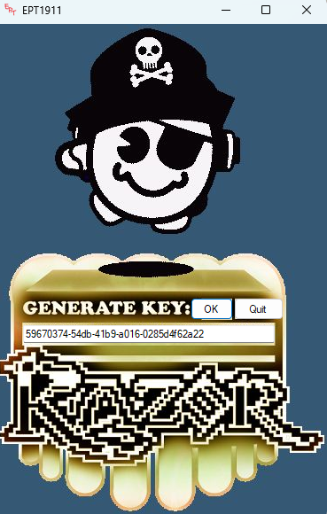
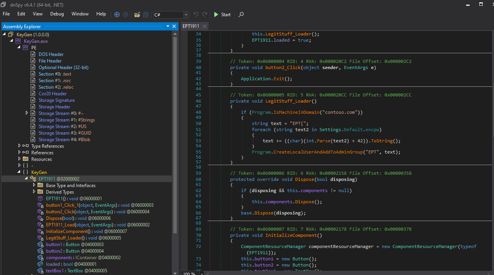
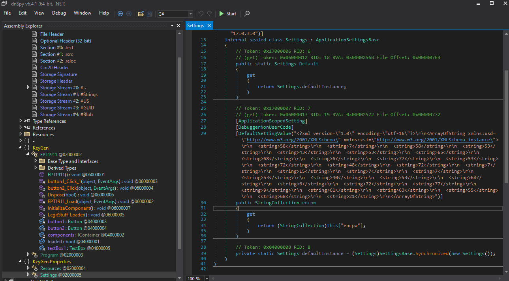
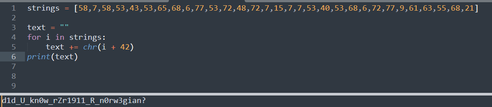

## Writeup

I denne oppgaven ble en tildelt en god gammeldags keygen KeyGen.exe. 

Etter å ha åpnet denne i dnspy fant jeg en `LegitStuff_Loader` metode som sjekker om maskinen er i `contoso.com` og lager en streng som starter med `EPT{`. Bingo.

Videre henter den tekst fra `Settings.Default.encpw` legger til 42 og gjør det om fra tegnkode.

I default settings ligger det en del tall, pakket i `<string>` og `\r\n`.

Slengte dette inn i sublimetext og etter litt search and replace hadde jeg tallene som vi kunne jobbe med.

`58,7,58,53,43,53,65,68,6,77,53,72,48,72,7,15,7,7,53,40,53,68,6,72,77,9,61,63,55,68,21`

Et lite python script, så har vi teksten.

Overså først siste delen av flagget, men siste delen av programmet `CreateLocalUserAndAddToAdminGroup` tar strengen vi har til nå, legger til `!}` og setter den som passord for brukeren. 

Da sitter vi igjen med hele flagget 

`EPT{d1d_U_kn0w_rZr1911_R_n0rw3gian?!}`