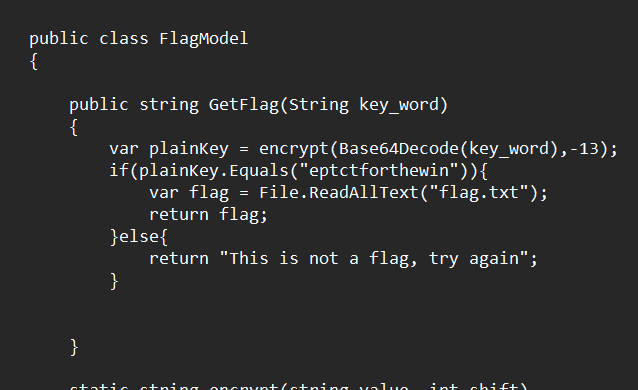
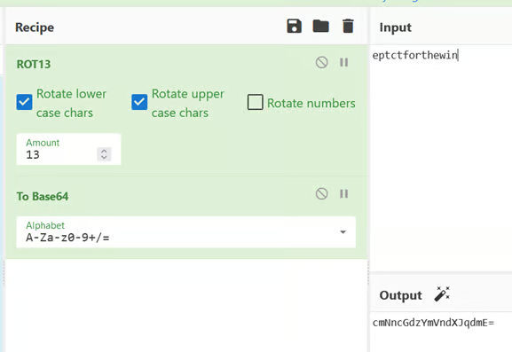
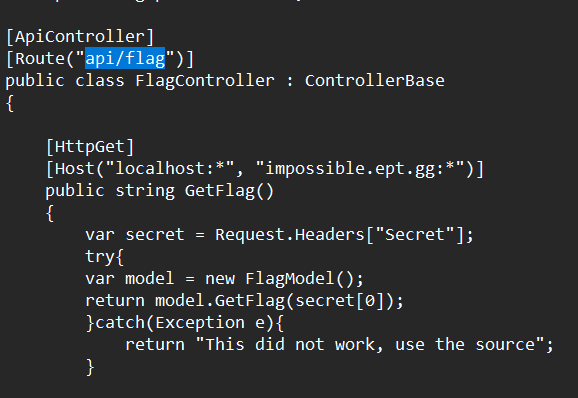
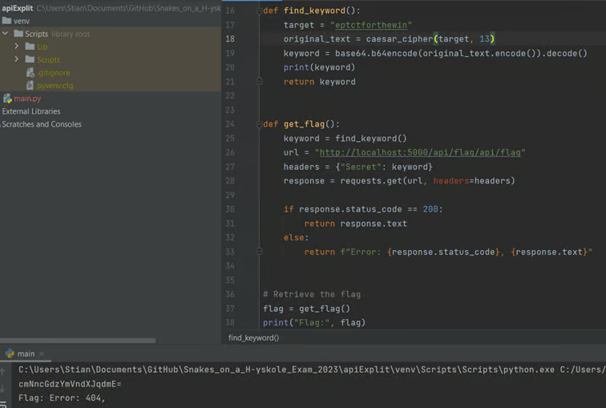
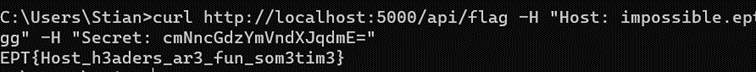

# FLAG API

Author: SpaceyLad

Original writeup: https://spaceylad.tech/flag-api-host-header-injection

Flag: `EPT{Host_h3aders_ar3_fun_som3tim3}`

## Disclaimer

I forgot to take screenshots while doing the CTF, so I am running the task inside a DOCKER container on my host machine. That is why you won’t see the original URLs and ports, but localhost:5000.

## Solution

As the task states: Development is never easy but this time we have made a nice flag api that may give you a flag if you have “knowlege of the source”. This is a very direct hint, telling us to carefully read through the source files that are provided with the tasks. Going through them, I learn a couple of things we need to do before crafting our payload.

In this function, we learn that the “password” to get the content of flag.txt is “eptctforthewin” that is encoded with rot13, then base64. Cyberchef is a perfect tool for this, so I craft the payload there.

https://icyberchef.com/#recipe=ROT13(true,true,false,13)To_Base64('A-Za-z0-9%2B/%3D')&input=ZXB0Y3Rmb3J0aGV3aW4

Sweet! Now that we have the payload “cmNncGdzYmVndXJqdmE=”. We need to figure out where to send this payload...

In “FlagController.cs” I find this, telling me that the payload must be sent to “/api/flag”. But there is a twist here… Before I saw places allowing anyone to send data, but this only takes data from the localhost or “impossible.ept.gg”. Which is weird, since we cannot send data as the server we are trying to hack, but we also do not have access to the “impossible.ept.gg” in any way.

At first, I tried making a Python script so I could keep testing until I eventually got the flag, but realized that this was a waste of time when I could easily just send it with curl in different ways. (And I struggeled making the script work, but I am too proud to say that out loud… so here it is in written form instead lol)

I tried sending the payload multiple times with the secret baked inn, but nothing seemed to work. I started to think I had to compromise the domain or somehow send it from the server itself, but my gut feeling said that was a bad path to take, since this is a web challenge. After consulting with ACE (My CTF AI partner in crime), he told me that it is possible to inject hosts into the header, which will make it look like you are sending it from a place you are not. This vulnerability is called a “Host Header injection” attack and I found this article on it.

https://github.com/daffainfo/AllAboutBugBounty/blob/master/Host%20Header%20Injection.md

I tried using the attack in with curl and WOOH! The server returned the contents of flag.txt! ❤️

