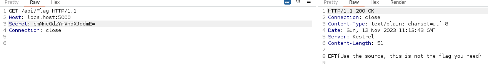

# Flag API
Author: iLoop

Flag: `EPT{Host_h3aders_ar3_fun_som3tim3}`
## Description
```
Development is never easy but this time we have made a nice flag api that may give you a flag if you have knowlege of the source
```

## Provided challenge files
* [WebSite.tar.gz](WebSite.tar.gz)

## Solution
### Preface
In this challenge, we got given a zip and an on-demand web service.
Based on the its on-demand, I expected that there might be some sort of user input being registered or that there were some sort of creation that would persist between different clients.

### Solving the challenge
When first accessing the site, it just returned a blank page. So I decided to jump into the code right away.
In the code we see many files that seem to be default files for .Net application. But there were two files that seemed interesting, `FlagController.cs` and `FlagModel.cs`.

I first took a look at the `FlagController.cs` file:
```cs
[Route("api/flag")]
public class FlagController : ControllerBase
{
    
    [HttpGet]
    [Host("localhost:*", "impossible.ept.gg:*")]
    public string GetFlag()
    {
        var secret = Request.Headers["Secret"];
        try{
        var model = new FlagModel();
        return model.GetFlag(secret[0]);
        }catch(Exception e){
            return "This did not work, use the source";
        }

    }
}
```
In this file we could see that we needed to either have the Host header `localhost:*` or `impossible.ept.gg:*`, so we need to keep that in mind. We can also see that the endpoint is located at `/api/Flag` Next we see that it takes the secret header(s), and passes the first entry to the `GetFlag` function in the `FlagModel` and returns the result.

Naturally, the next step was to look at the model, and try to figure out how we can get the flag.

The `FlagModel` file has a few functions; Base64 encoding/decoding, "encryption" and of course GetFlag. I assume that the Base64 encoding/decoding functionallity does what it says on the tin, so we can ignore that.

We follow the program logic, and continue the flow by first looking at the `GetFlag` function. We see that if our input after being base64 decoded and encrypted equals the string `eptctforthewin` the function returns the flag.
```cs
public string GetFlag(String key_word) {
    var plainKey = encrypt(Base64Decode(key_word),-13);
    if(plainKey.Equals("eptctforthewin")) {
        var flag = File.ReadAllText("flag.txt");
        return flag;
    } else {
        return "This is not a flag, try again";
    }
}
```

The base64 decoding is easy, so we really only need to look at the encryption. The function takes two inputs, our input and -13. Based on the number 13, I immediatly thought of Rot13. And after a quick glance at the "encryption" function that seemed to be correct.

```cs
static string encrypt(string value, int shift) {
    char[] buffer = value.ToCharArray();
    for (int i = 0; i < buffer.Length; i++) {
        char letter = buffer[i];
        letter = (char)(letter + shift);
        if (letter > 'z') {
            letter = (char)(letter - 26);
        } else if (letter < 'a') {
            letter = (char)(letter + 26);
        }
        buffer[i] = letter;
    }
    return new string(buffer);
}
```

So the key went into CyberChef, and we got that the secret we should use is `cmNncGdzYmVndXJqdmE=`.

By adding this to the Secret header we get the flag.

