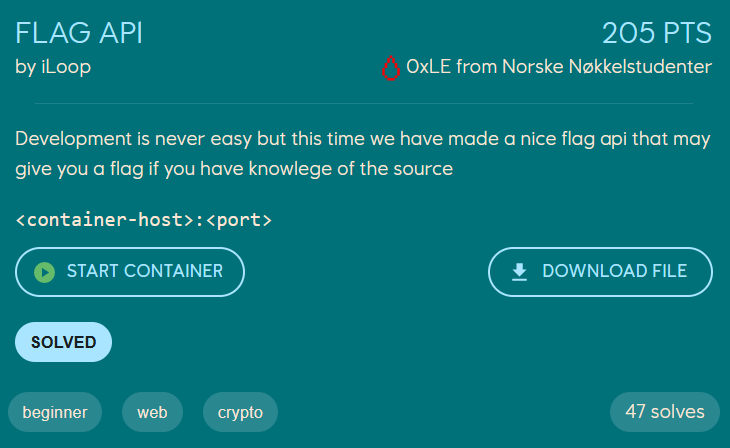
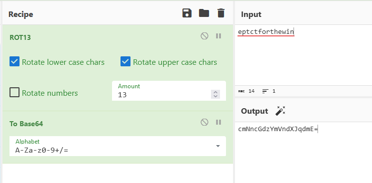

# Flag API

<p>
    
</p>

Opening the webpage of the challenge we onyl see `no website hosted here `, but we are given the C# source code for the website.

In the `Controllers` directory there is a file `FlagController.cs` which defines the route `api/flag`

```cs
[ApiController]
[Route("api/flag")]
public class FlagController : ControllerBase
{

    [HttpGet]
    [Host("localhost:*", "impossible.ept.gg:*")]
    public string GetFlag()
    {
        var secret = Request.Headers["Secret"];
        try{
        var model = new FlagModel();
        return model.GetFlag(secret[0]);
        }catch(Exception e){
            return "This did not work, use the source";
        }

    }
}
```

`[HttpGet]` indicates that this endpoint accepts GET requests, and `[Host("localhost:*", "impossible.ept.gg:*")]` indicates that the Host-header has to be either `localhost` or `impossible.ept.gg`.

If the Host-header is set correctly, the value in the header `Secret` in retrieved and passed to the function `GetFlag` from the `FlagModel` class, which is located in the `Models` directory.

The `GetFlag` function looks like the following
```cs
public string GetFlag(String key_word)
{
    var plainKey = encrypt(Base64Decode(key_word),-13);
    if(plainKey.Equals("eptctforthewin")){
        var flag = File.ReadAllText("flag.txt");
        return flag;
    }else{
        return "This is not a flag, try again";
    }
}
```

The function base64-decodes the value we pass in the Secret header, and encrypts it with `-13` as the second argument. If the result from the `encrypt` function is `eptctforthewin` we get the flag.

The encrypt function is defined in the `FlagModel` class aswell, and is a simple rotation cipher. We know that the shift amount if -13.
```cs
static string encrypt(string value, int shift)
{
    char[] buffer = value.ToCharArray();
    for (int i = 0; i < buffer.Length; i++)
    {
        char letter = buffer[i];
        letter = (char)(letter + shift);
        if (letter > 'z')
        {
            letter = (char)(letter - 26);
        }
        else if (letter < 'a')
        {
            letter = (char)(letter + 26);
        }
        buffer[i] = letter;
    }
    return new string(buffer);
}
```

To retrieve the flag we ROT13 `eptctforthewin` and base64 encode the value. If we pass this as the value of the HTTP-header `Secret`, and the Host-header `localhost` or `impossible.ept.gg`, we should get the flag.

<p>
    
</p>

```console
loevland@hp-envy:~/ctf/ept/web/flag_api$ curl io.ept.gg:37419/api/flag -H "Host: impossible.ept.gg" -H "Secret: cmNncGdzYmVndXJqdmE="
EPT{Host_h3aders_ar3_fun_som3tim3}
```