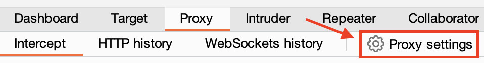
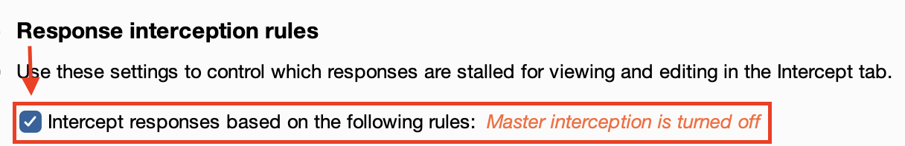
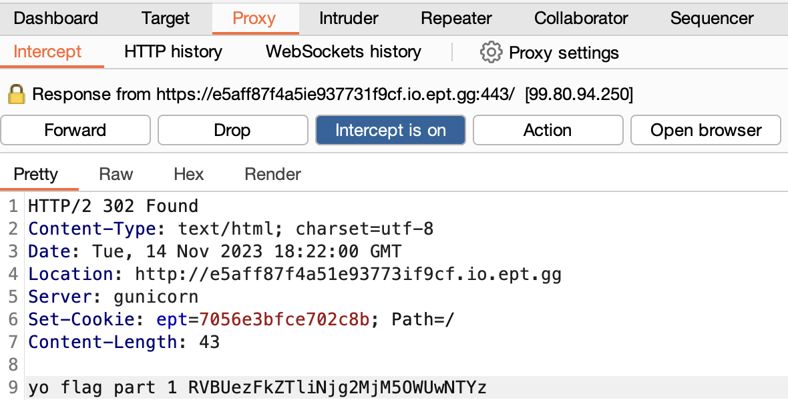
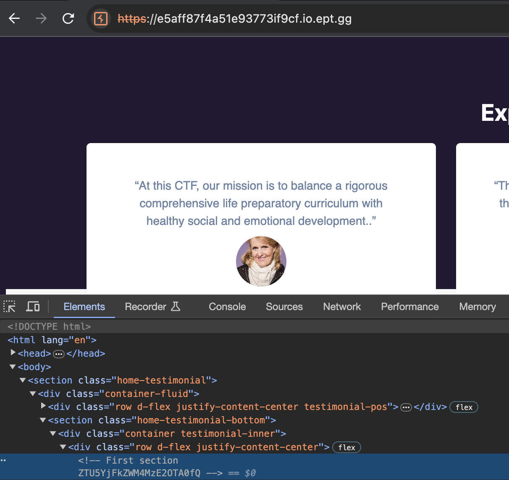
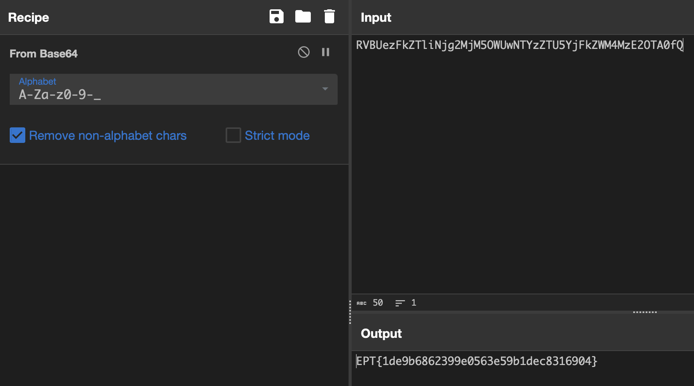

# Partly
Author: zledge

Flag: `EPT{1de9b6862399e0563e59b1dec8316904}`
## Description
```
Look closer. If you blink, you’ll miss it. 


 Site: [e5aff87f4a51e937731f9cf.io.ept.gg](https://e5aff87f4a51e937731f9cf.io.ept.gg)
```

## Writeup
This challenge was solved in *Burp Suite*, by taking a closer look at all the traffic between the client and server. In order to inspect all the traffic, we need to make some slight modifications to the default Proxy settings, which can be accessed here:



We then have to make sure to also intercept the response, by checking the following box:



Thereafter, we can finally access the provided webpage and look through each request and response. This reveals a redirect chain of ```302 Found``` responses, of which one contains the first part of our flag:



The second part of the flag can be found within the actual website we eventually reach. This part of the flag is hidden within the source HTML as a comment:



Setting the two parts together and decoding from base64 in *CyberChef* gives ut the flag:

