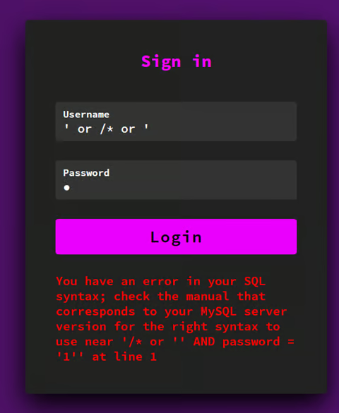
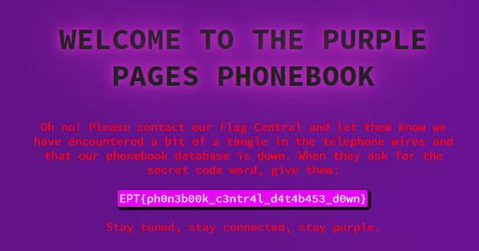

# The Purple Pages

Writeup for EPT CTF- The Purple Pages (I will never get tired of DALLES fantastic way of spelling things...)

Author: SpaceyLad

Original writeup: https://spaceylad.tech/the-purple-pages-sqli-login-bypass

Flag: ` EPT{ph0n3b00k_c3ntr4l_d4t4b453_d0wn}`

## Solution

This was a fairly simple task. Considering we were given no hint with a username, any password hint, and when gobusting the room only leads us to a page we are unauthenticated to visit, I quickly realized that this must be some sort of SQLI room.

I was lazy, so I went to hacktricks and found a couple og injections syntaxes I wanted to try out. My first goal was to make an error happen, just to confirm that it is in fact SQLI that is the vulnerability.
https://book.hacktricks.xyz/pentesting-web/login-bypass

login all together. I remembered that commenting out the password part is an effective way of just focusing on the username part of the login. So I crafted this syntax. “' OR '1'='1' -- ” (Note that the space behind the “—” is very important to actually comment out the password section.

I tried it out and BAM! The flag is ours!

