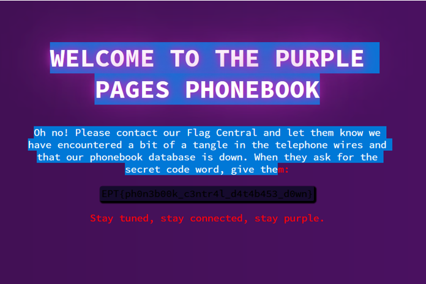

# THE PURPLE PAGES
**Author: potatochips4dinner**

**Description:**  
Call me, maybe

**Site:** [purplepages](https://purplepages.io.ept.gg/)

---

## Professional Analysis
**By A.Meland**

### WRITEUP – PURPLE PAGES – EPT 2023

**Initial Engagement:**  
The "THE PURPLE PAGES" challenge commenced with an interface typical of web-based login forms, accessible at [https://purplepages.io.ept.gg/](https://purplepages.io.ept.gg/). This setup provided an ideal testbed for assessing and exploiting common web vulnerabilities.

**Tactics and Strategy:**  
Confronted with the login interface, my preliminary tactic was to test against standard credential pairs, a method revealing potential weaknesses in rudimentary authentication systems. The attempt with 'admin' as both username and password, however, did not yield access, necessitating a pivot to more advanced penetration techniques.

**Exploitation via SQL Injection:**  
My next course of action involved leveraging SQL injection, a critical web application vulnerability. The injection string `' OR '1'='1' --` was deployed in the password field while maintaining 'admin' as the username. This SQL statement, ingeniously simple yet effective, successfully circumvented the authentication process, highlighting the susceptibility of the system to injection attacks.

**Conclusion and Reflection:**  
Gaining unauthorized access underscored the imperative for robust security measures in web applications. This exercise vividly illustrates the necessity for developers to be vigilant against SQL injection vulnerabilities, a perennial threat in the cybersecurity landscape.

---

**Flag Captured:** `EPT{ph0n3b00k_c3ntr4l_d4t4b453_d0wn}`

---

*Ethical Reminder:* This writeup serves purely educational purposes. The SQL injection technique employed in this challenge underscores a prevalent security risk. It is imperative to practice such skills ethically, confined to legal frameworks and educational environments like CTF challenges.
