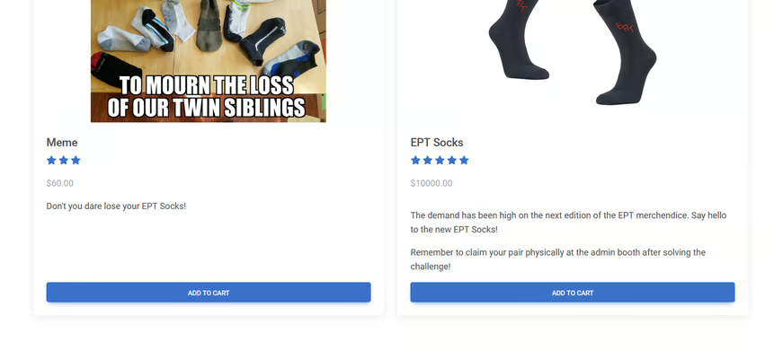
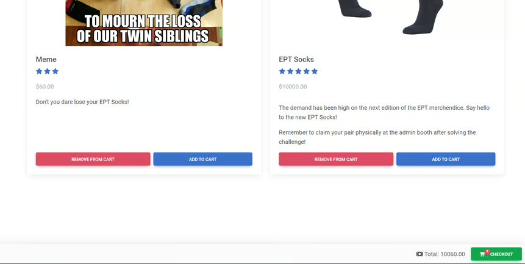
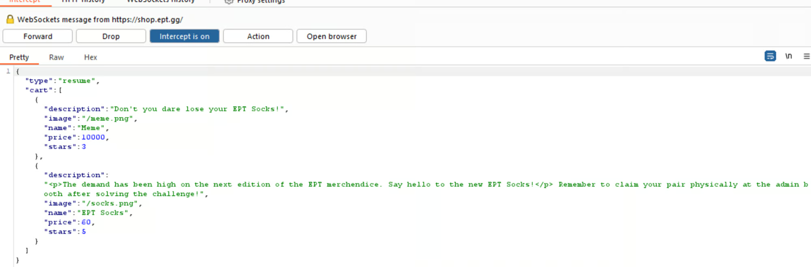
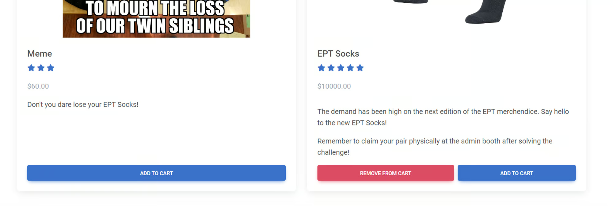

# Shop-3

Author: SpaceyLad

Original writeup: https://spaceylad.tech/shop-3-hmac-vulnerability

Flag: `EPT{r3m3mb3r_t0_cl4im_y0ur_hq_ept_s0ck5!}`

## Preface

This challenge was a tricky one. Not having any idea how HMAC works before the challenge started, and not too much experience with JSON formatted data being sent to and from the server made this quite difficult, but also a very giving challenge! In a way that after completing it, I learned so many new things within the domain of web app security. In this writeup, we will go through this whimsical and fun journey to get THE EPT SOCK!

## Solution

The first thing I did was the classic recon and enumeration phase. Since we got access to the source python Flask file, I could use this to fully understand what is going on in the backend. I clicked around on the website, checking what buttons worked, which did not, and used Burp Suite to manually inspect the packages. I noticed that JSON data was being sent to the server… Which was my first mistake. I thought all JSON data was being sent to the server, I did not notice the “to” and “from” indicator on Burp. This confused me, since I manipulated data being sent from the server, so I changed the frontend, not the backend… Which did not help a lot.

After realizing this, I went away from the idea of directly changing the data in the request packs, focusing on finding new attack vectors. I tried injecting objects into the inventory, tricking the website to change the amount of money I had to be minus and plenty of other things, but in no avail. So I started injecting functions being sent to the server, and noticed that this function returned something exciting…

I did some research and learned the basics about HMAC, and my first ideas was to crack the key that was generated. But in the source code, it says that the key is randomly generated 32 bytes every time the application is started, something I misunderstood and thought happened every time I disconnected from the server because of the timeout function. ( I can confirm that this did not happen because the HMAC key was the same, every time I reloaded the page and generated one, based on the content.)

At this point, I was on a loss for a long time. I had no idea how to trick the website to let me manipulate objects, so I took a long break and worked on other tasks.

## The last chance

19:30 I came back to the task. A little defeated by the other difficult tasks, I decided to give it one last try. This time I had some of my team mates over, and I decided to explain to them what I had done. And for some magical reason, when explaining this out loud, I suddenly got more ideas on how to abuse the logic. The clock was 19:55, I added 2 objects into the shopping cart... I exported the cart with the signature key, asked GPT to convert the format to something I can send with the resume function, but then I swapped the prices for the two objects. Which means that bytewise, nothing had changed! Only the location of the bytes! I pushed it inn… AND IT WORKED!!

I remove the now VERY expensive meme and only had the now cheap socks in the cart… I pressed the checkout button… And it worked?

I called the flag function and BAAM! We got the flag!!! I posted it 19:58 and ran up on the stage, and took my well-deserved EPT socks. (On a side note, I think my pulse was far above 150 bpm at that point…)

Genuine reaction as I get the flag right before the timer runs out. Thanks to my awesome team mates for supporting me in those... Stressfull/joyfull times 😂

